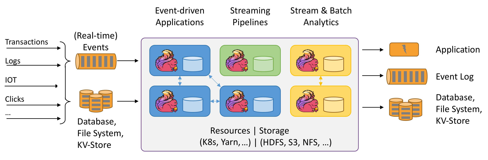
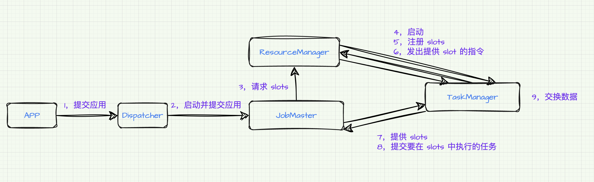

### Flink(Scala) 入门

### 1，概述
- Apache Flink 是一个框架和分布式处理引擎，用于对无界和有界数据流进行状态计算；
  - 高吞吐，低延迟；
  - 结果的准确性；
  - 精确一次(exactly-once)的状态一致性保证；
  - 可以与众多常用存储系统连接；
  - 高可用，支持动态扩展；



#### 1.2 Flink vs Spark
- 数据模型
  - Spark 采用 RDD 模型，Spark Streaming 的 DStream 实际上是一组组小批数据 RDD 的集合；
  - Flink 基本数据模型是数据流，以及事件（Event）序列；
- 运行时架构
  - Spark 是批运算，将 DAG 划分为不同的 Stage，一个完成后才可以计算下一个；
  - Flink 是标准的流执行模式，一个事件在一个节点处理完成后可以直接发往下一个节点进行处理；

#### 1.3 快速上手
- `pom.xml`

<details>
<summary></summary>

```xml
<!-- Flink 相关依赖 -->
<dependencies>
	<dependency>
		<groupId>org.apache.flink</groupId>
		<artifactId>flink-scala_2.12</artifactId>
		<version>1.13.0</version>
	</dependency>
	<dependency>
		<groupId>org.apache.flink</groupId>
		<artifactId>flink-streaming-scala_2.12</artifactId>
		<version>1.13.0</version>
	</dependency>
	<dependency>
		<groupId>org.apache.flink</groupId>
		<artifactId>flink-clients_2.12</artifactId>
		<version>1.13.0</version>
	</dependency>
</dependencies>

<build>
    <plugins>
	  <!-- 打包配置 -->
      <plugin>
        <groupId>org.apache.maven.plugins</groupId>
        <artifactId>maven-assembly-plugin</artifactId>
        <version>3.3.0</version>
        <configuration>
          <descriptorRefs>
            <descriptorRef>jar-with-dependencies</descriptorRef>
          </descriptorRefs>
        </configuration>
        <executions>
          <execution>
            <id>make-assembly</id>
            <phase>package</phase>
            <goals>
              <goal>single</goal>
            </goals>
          </execution>
        </executions>
      </plugin>
    </plugins>
  </build>
```

- DataSet API 进行处理

```java
def main(args: Array[String]): Unit = {
	// 1, 创建一个执行环境
	val env = ExecutionEnvironment.getExecutionEnvironment

	// 2, 读取文本数据
	val lineDataSet = env.readTextFile("src/main/resources/input/demo.txt")

	// 3, 对数据集进行转换处理
	val wordAndOne = lineDataSet.flatMap(_.split(" ")).map(word => (word, 1))

	// 4, 按照单词进行分组
	val wordGroup = wordAndOne.groupBy(0)

	// 5, 对分组数据进行 sum 聚合统计
	val result = wordGroup.sum(1)

	result.print()
}
```

- DataStream API 有界流处理

```java
def main(args: Array[String]): Unit = {
	// 1，创建一个流式执行环境
	val env = StreamExecutionEnvironment.getExecutionEnvironment

	// 2，读取文本文件数据
	// val lineDataStream = env.readTextFile("src/main/resources/input/demo.txt")
	// 也可以读取 socket 流数据
	//  nc -lk 8888 启动服务器
	val lineDataStream = env.socketTextStream("127.0.0.1", 8888)

	// 3, 对数据集进行转换处理
	val wordAndOne = lineDataStream.flatMap(_.split(" ")).map(data=>(data, 1))

	// 4, 按照单词进行分组
	val wordGroup = wordAndOne.keyBy(data => data._1)

	// 5, 对分组数据进行 sum 聚合统计
	val result = wordGroup.sum(1)

	result.print()

	// 6, 执行任务
	env.execute()
}
```
</details>

#### 1.4 Flink 常用命令
- 启动集群命令：`./bin/start-cluster.sh`

#### 1.5 Flink 系统架构


#### JobManager
- JobManager 是 Flink 集群中任务管理和调度的核心，它决定何时调度下一个 task(或一组 task)、对完成的 task 或执行失败做出反应、协调 checkpoint、并且协调从失败中恢复等。这个进程由三个不同的组件组成：
  - ResourceManager：负责 Flink 集群中的资源提供、回收、分配 - 它管理 **task slots**，这是 Flink 集群中资源调度的单位；
  - Dispatcher：用来提交 Flink 应用程序执行，并为每个提交的作业启动一个新的 JobMaster；
  - JobMaster：负责管理单个 JobGraph 的执行。Flink 集群中可以同时运行多个作业，每个作业都有自己的 JobMaster；

#### TaskManagers
  - TaskManager(也称为 worker)执行作业流的 task，并且缓存和交换数据流。
  - 必须始终至少有一个 TaskManager，在 TaskManager 中资源调度的最小单位是 task slot。TaskManager 中 task slot 的数量表示并发处理 task 的数量。

#### 任务提交流程



#### Streaming DataFlow


- 所有的 Flink 程序都是由三部分组成的：Source、Transformation 和 Sink
  - Source 负责读取数据源；
  - Transformation：利用各种算子进行处理加工；
  - Sink：负责输出；

#### 并行度
- 下图中样例数据流用 5 个 subtask 执行，因此有 5 个并行线程：


