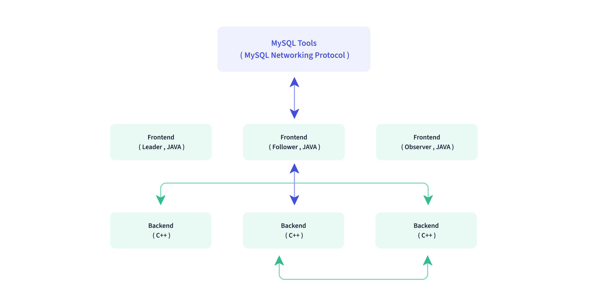

<!--
### Doris 入门
### 1，概述
- Doris 是一个现代化的大规模并行处理分析型数据库产品，仅需亚秒级响应时间即可获得查询结果，有效地支持实时数据分析。

#### 整体架构
- Doris 只有两类进程：
  - **Fronted(FE)**：主要负责用户请求的接入、查询解析计划、元数据的管理、节点管理相关工作；
  - **Backend(BE)**：主要负责数据存储，查询计划的执行；

// TODO:
 P03