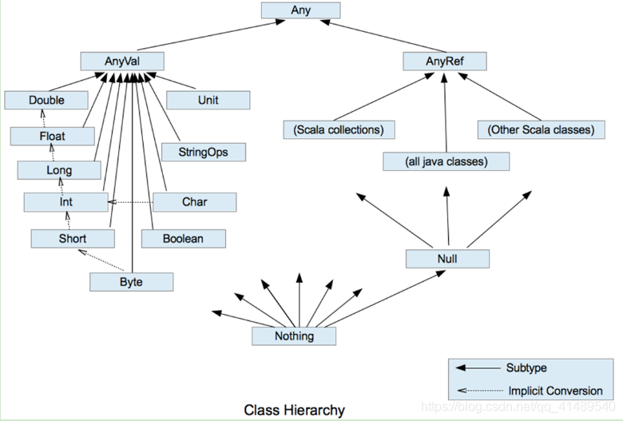
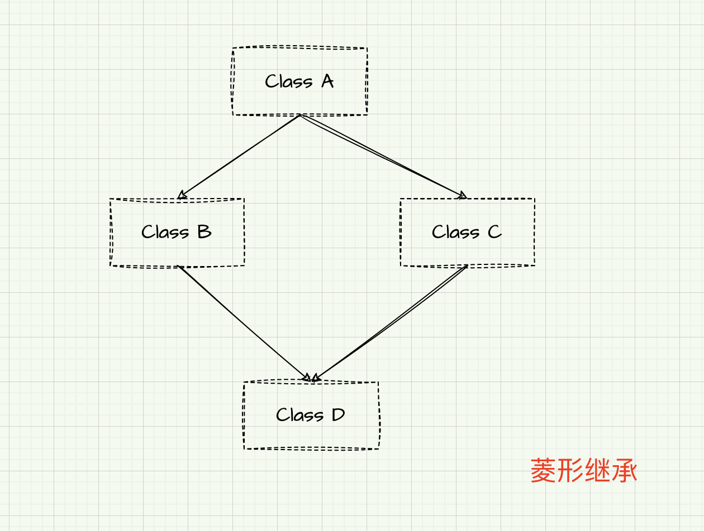

Scala 入门

### 1. Scala 介绍
- Scala 是一门函数式编程语言；
- Scala 对集合类型数据处理有非常好的支持；

#### 1.2 Hello World
- 编译 `scalac HelloScala.scala`
- 运行 `scala HelloScala`

```scala
/**
 * object: 关键字，表示声明一个单例对象（伴生对象）；
 */
object HelloScala {
	def main(args: Array[String]): Unit = {
		println("Hello Scala")	// 末尾没有分号
	}
}
```

#### 1.3 IDEA 编辑 Scala
- 下载`Scala`插件；
- 创建 `scala` 目录，右键`Mark Directory as`->`Sources Root`；
- 在项目上右键`Add Framework support...`，增加 scala 的支持；
- `new -> Scala Class -> object` 来创建 `scala` 的对象；

### 2. 变量和数据类型
#### 2.1 基本语法
- `var 变量名 [: 变量类型] = 初始值`
- `val 常量名 [: 常量类型] = 初始值`
- 注意事项：
  - 声明变量时，类型可以省略，编译器自动推导，即类型推导；
  - 类型确定后，就不能修改，说明 Scala 是强数据类型语言；
  - 变量声明时，必须要有初始值；
  - 在声明/定义一个变量时，可以使用 `var` 或 `val` 来修饰，`var` 修饰的变量可改变；

#### 2.2 标准输入/输出
```scala
object Test_io {
	def main(args: Array[String]): Unit = {
		// test_output()
		// test_input()
	}

	def test_output(): Unit = {
		var name: String = "张三"
		var addr: String = "北京"
		// 字符串拼接
		println(name + "在东北眺望" + addr)

		// printf
		printf("%s在%s打工", name, addr)

		// 字符串模板（插值字符串），通过 $ 获取变量值
		println(s"${name}的老家在${addr}")
	}

	def test_input(): Unit = {
		println("请输入姓名：")
		val name: String = StdIn.readLine()
		println("请输入年龄：")
		val age: Int = StdIn.readInt()

		println(s"${name}今年${age}岁")
	}

	def file_io(): Unit = {
		// 从文件中读取数据
		Source.fromFile("src/main/resources/application.yml").foreach(print)
		
		// 向文件写入数据
		val writer = new PrintWriter(new File("src/main/resources/output.txt"))
		writer.write("this is test")
		writer.close()
	}
}
```

#### 2.3 数据类型
- Scala 中一切数据都是对象，都是`Any`的子类
- Scala 中数据类型分为两大类：数值类型(`AnyVal`)、引用类型(`AnyRef`)
- Scala 中的 `StringOps` 是对 Java 中的 String 的增强
- `Unit`: 对应 Java 中的 void
- `Null` 是所有引用类型（`AnyRef`）的子类
- `Nothing` 是所有数据类型的子类



- 整数类型
  - `Byte`、`Short`、`Int`、`Long`
- 字符串类型
  - `Char`
- 布尔类型
  - `Boolean`
- `Unit`: 等同于 void，只有一个实例值，写成`()`；
- `Null`：只有一个实例值 null；
- `Nothing`：是任何其他类型的子类型；

### 3. 运算符
### 4. 流程控制
- `if...else...`
- `switch`
- `for`
- `while`

#### 4.1 `for` 循环
```scala
// for 循环
  def for_demo(): Unit = {
    // 范围遍历
    for(i <- 1 to 10){
      println(i+"\t 次")
    }
    println("第二次调用")
    // to 为方法调用
    // Predef 类 intWrapper 隐式类型转换
    for(i <- 1.to(10)) {
      println("to method i\t" + i)
    }

    // 左闭右开区间遍历
    println("range.........")
    for (i <- Range(1, 10)) {
      println("range i\t" + i)
    }

    println("until.........")
    for (i <- 1 until 10) {
      println("until i\t" + i)
    }

	println("reverse........")
	for (i <- 1 to 10 reverse) {
		println("reverse i\t" + i)
	}
  }
```

#### 4.2 循环守卫
- 循环守卫，即循环保护式（也称条件判断式），保护式为`true`则进入循环，`false`则跳过；
```scala
for (i <- 1 to 3 if i != 2) {
	println("i \t" + i)
}
```

#### 4.3 循环步长
```scala
println("step.......")
for (i <- (1 to 10).by(2)) {
	println("step2 i\t" + i)
}

println("step2......")
for (i <- 1 to 10 by 2) {
	println("step i\t" + i)
}
```

#### 4.4 嵌套循环
```scala
def for_demo2(): Unit = {
	for (i <- 1 to 3; j <- 1 to 3) {
		println("i = " + i + "\tj = " + j)
	}
}
```

#### 4.5 引入变量
```scala
for (i <- 1 to 5; j = 10 - i) {
	println("i = " + i + "\tj=" + j)
}

// 等同于
for {
	i <- 1 to 5
	j = 10 - i
} {
	println("i = " + i + "\tj=" + j)
}
```

#### 4.6 循环中断
- Scala 内置控制结构去掉了`break` 和 `continue`，是为了更好的适应**函数式编程**；
- Scala 中使用 `breakable` 控制结构来实现 break 和 continue 功能；
```scala
Breaks.breakable(
	for (i <- 0 until 10) {
	if (i == 3)
		Breaks.break()
	println("Breakable i\t" + i)
	}
)
```

### 5. 函数式编程
- 面向对象编程：
  - 解决问题：分解对象，行为，属性，然后通过对对象的关系以及行为的调用来解决问题；
  - 对象的本质：对数据和行为的一个封装；
- 函数式编程
  - 解决问题时，将问题分解成一个一个的步骤，将每个步骤进行封装（函数），通过调用函数来解决问题；
  - Scala 中**函数是一等公民**，像变量一样，既可以作为函数的参数使用，也可以将函数赋值给一个变量，函数的创建不需要依赖对象或类；

#### 5.1 函数基础
- 为完成某一功能的程序语句的集合，称为函数；
- 类中的函数称为方法

```scala
// 函数定义
def sum(x: Int, y: Int): Int = {
	x + y
}

// 可变参数
def f1(str: String*): Unit = {
	println(str)
}

// 只有一行代码，返回值类型能够推断出来，则可以简写为：
def f2(name: String) = name

// Scala 如果期望是无返回值类型，可以省略等号；
def f3(name: String) {
	println(name)
}

// 如果函数无参，但是声明了参数列表，那么调用时，小括号可加可不加；
def f4(): Unit = {
	println("empty parameter")
}

// 调用方式：小括号可加可不加
f4()
// 或者
f4

// 如果函数没有参数列表，那么小括号可以省略，调用时小括号必须省略；
def f5: Unit = {
	println("empty parameter")
}

// 调用方式：小括号必须省略
f5

// 匿名函数，lambda 表达式
val fun = (name: String) => {
	println("abc....."+name)
}
fun("bcd")

// 定义一个函数，以函数作为参数输入
def f(fun_param: String => Unit): Unit = {
	fun_param("天气晴朗")
}

// 调用时，传入匿名函数 fun
f(fun)

// 直接传入匿名函数
f((name: String) => {println(name)})
```

#### 5.2 函数至简原则
- 函数至简原则：**能省则省**
- 至简原则细节：
  - `return` 可以省略，Scala 会使用函数体的最后一行代码作为返回值；
  - 如果函数体只有一行代码，可以省略花括号；
  - 返回值类型如果能够推断出来，那么可以省略（`:`和返回值类型一起省略）
  - 如果有`return`，则不能省略返回值类型，必须指定；
  - 如果函数明确声明 `Unit`，那么及时函数体中使用`return`关键字也不起作用；
  - Scala 如果期望是无返回值类型，可以省略等号；
  - 如果函数无参，但是声明了参数列表，那么调用时，小括号可加可不加；
  - 如果函数没有参数列表，那么小括号可以省略，调用时小括号必须省略；
  - 如果不关心名称，只关心逻辑处理，那么函数名（`def`）可以省略；

#### 5.3 函数高级
- 函数可以作为值进行传递；
- 函数可以作为参数进行传递；
- 函数可以作为函数返回值返回；

```scala
def f(n: Int): Int = {
	println("f() 调用...")
	n + 1
}

// 1, 函数作为值进行传递
val f1: Int=>Int = f
// 或者
val f2 = f _

println(f1)
println(f1(234))
println(f2)
println(f2(89))

// 2, 函数作为函数的参数进行传递
// 定义二元计算
def dualEval(op: (Int, Int)=>Int, a: Int, b: Int): Int = {
	op(a, b)
}

def add(a: Int, b: Int): Int= {
	a + b
}

println(dualEval(add, 12, 35))
// 匿名函数
println(dualEval((a, b)=> a+b, 12, 35))

// 3, 函数作为函数的返回值返回
def f5(): Int=>Unit = {
	def f6(a: Int): Unit = {
		println("f6 调用" + a)
	}
	f6	// 将函数直接返回
}
```

#### 5.4 匿名函数
- 没有名字的函数就是匿名函数：`(x:Int) => {函数体}`；
- **传匿名函数**至简原则：
  - 参数类型可以省略，会根据形参进行自动的推导；
  - 类型省略之后，发现只有一个参数，则圆括号可以省略；其他情况：没有参数或参数超过 1 的永远不能省略圆括号；
  - 匿名函数如果只有一行，则大括号也可以省略；
  - 如果参数只出现一次，则参数省略且后面参数可以用`_`代替；

```scala
// 定义一个函数，以函数作为参数输入
def f(fun_param: String => Unit): Unit = {
	fun_param("天气晴朗")
}

// 传参时，会根据函数 f 的形参进行自动推导
f((name: String) => {println("省略参数类型之前" + name)})

// 可以简写为：
f((name) => {println("自动推导参数类型:\t" + name)})

// 匿名函数如果只有一行，则大括号也可以省略；
f(name => println("大括号省略" + name))

// 如果参数只出现一次，则参数省略且后面参数可以用`_`代替；
f(println(_))

// 如果推断出，当前传入的 println 是一个函数体，而不是调用语句，可以直接省略下划线
f(println)
```

#### 5.5 函数柯里化和闭包
- **闭包**：如果一个函数，访问到了它的外部（局部）变量的值，那么这个函数和他所处的环境，称为闭包；
- **函数柯里化**：把一个参数列表的多个参数，变成多个参数列表；

#### 5.6 控制抽象
- 传值参数：把计算后的值传递过去；
- 传名参数：把代码传递过去；

```scala
// 传值参数
def f2(a: Int): Unit = {
	println("a: " + a)
}

// 传名参数
def f3(): Int = {
	println("f3 调用")
	12
}

// 传名参数，传递的不再是具体的值，而是代码块
def f4(a: =>Int): Unit = {
	println("a: " + a)
	println("a: " + a)
}

f4(105)
f2(f3())
```

- 示例 2
```scala
def main(args: Array[String]): Unit = {
    var n = 10

    // 1. 常规 while 循环
    while (n >= 1) {
      println(n)
      n -= 1
    }

    // 2. 用闭包实现一个函数，将代码块作为参数传入
    def myWhile(condition: =>Boolean): (=>Unit)=>Unit = {
      // 内层函数需要递归调用，参数就是循环体
      def doLoop(op: =>Unit): Unit = {
        if(condition) {
          op
          myWhile(condition)(op)
        }
      }
      doLoop
    }

    n = 10
    myWhile(n >= 1) {
      println(n)
      n -= 1
    }

    // 3. 匿名函数
    def myWhile2(condition: =>Boolean): (=>Unit)=>Unit = {
      // 内层函数需要递归调用，参数就是循环体
      op => {
        if (condition) {
          op
          myWhile2(condition)(op)
        }
      }
    }

	// 4. 柯里化
    def myWhile3(condition: =>Boolean)(op: =>Unit): Unit = {
        if (condition) {
          op
          myWhile3(condition)(op)
        }
    }
}
```

#### 5.7 惰性加载
- 当函数返回值被声明为`lazy`时，函数的执行将被推迟，直到我们首次对此取值，该函数才会执行；

### 6. 面向对象
#### 6.1 访问权限
- Scala 中属性和方法的默认访问权限为 public, 但 Scala 中无 public 关键字；
- private 为私有权限，只在类的内部和伴生对象中可用；
- protected 为受保护权限， Scala 中受保护权限比 Java 中更严格，同类、子类可以访问，同包无法访问；
- private[包名]增加包访问权限，包名下的其他类也可以使用；

#### 6.2 构造器
- Scala 类的构造器包括：主构造器和辅助构造器
  - 辅助构造器，函数的名称`this`，可以有多个，编译器通过参数的个数及类型来区分；
  - 辅助构造方法不能直接构建对象，必须直接或者间接调用主构造方法；
  - 构造器调用其他另外的构造器，要求被调用构造器必须提前声明；
```scala
class 类名(形参列表) {	// 主构造器
	
	// 类体

	def this(形参列表) {	// 辅助构造器 1

	}

	def this(形参列表) {	// 辅助构造器 2

	}
}
```

- Scala 类的主构造器函数的形参包括三种类型：未用任何修饰、`var`修饰、`val`修饰
  - 未用任何修饰符修饰，这个参数就是一个局部变量；
  - `var`修饰参数，作为类的成员属性使用，可以修改；
  - `val`修饰参数，作为类只读属性使用，不能修改；
```scala
def main(args: Array[String]): Unit = {
	
	val student2 = new Student2
	student2.name = "张三"
	student2.age = 19
	println(s"student2: name = ${student2.name}, age = ${student2.age}")

	val student3 = new Student3("李四", 20)
	println(s"student3: name = ${student3.name}, age = ${student3.age}")
}

// 定义类
// 方式一：无参构造器
class Student2{
	// 单独定义属性
	var name: String = _
	var age: Int = _
}

// 方式二：主构造器，使用 var 修饰参数
class Student3(var name: String, var age: Int)

// 方式三：主构造器参数 无修饰
// 外部无法调用 name 和 age
class Student4(name: String, age: Int) {

}

// val 修饰参数
class Student5(val name: String, val age: Int)

// 主构造器 + 辅助构造器
class Student6(var name: String, var age: Int) {
	var school: String = _

	// 辅助构造器
	def this(name: String, age: Int, school: String) {
		// 调用主构造器
		this(name, age)
		this.school = school
	}
}
```

#### 6.3 单例对象（伴生对象）
- Scala 语言是**完全面向对象**的语言，所以并没有静态的操作（即在 Scala 中没有静态的概念）。但是为了能够和 Java 语言交互（因为 Java 中有静态概念），就产生了一种特殊的对象来模拟类对象，该对象称为**单例对象**。若单例对象名与类名一致，则称该单例对象为这个类的**伴生对象**。这个类的所有“静态”内容都可以放置在它的伴生对象中声明。
	- 单例对象采用`object`关键字声明；
	- 单例对象对应的类称之为**伴生类**，伴生对象的名称应该和伴生类名一致；
	- 单例对象中的属性和方法都可以通过伴生对象名（类名）直接调用访问；
```scala
// 基本语法
object Person {
	val country: String = "北京"
}
```

- 示例一：
```scala
// 定义类
class Employee(val name: String, val age: Int) {
	def printInfo() {
		println(s"employee: name = ${name}, age = ${age}, companys = ${Employee.company}")
	}
}

// 伴生对象
object Employee {
	val company: String = "创意无限公司"
}
```

- 示例二：构造函数私有化
```scala
def main(args: Array[String]): Unit = {
	// apply 方法调用
	val employ01 = Employee.apply("李元芳", 29)
	employ01.printInfo()

	// apply 方法简短写法
	val employ02 = Employee("狄仁杰", 29)
	employ02.printInfo()
}

// 类构造函数私有化
class Employee private(val name: String, val age: Int) {
	def printInfo() {
		println(s"employee: name = $name, age = $age, company = ${Employee.company}")
	}
}

// 伴生对象
object Employee {
	val company: String = "创意无限公司"

	// 定义一个类的对象实例的创建方法
	def newEmployee(name: String, age: Int): Employee = new Employee(name, age)

	// apply 方法
	def apply(name: String, age: Int): Employee = new Employee(name, age)
}
```

#### 6.4 特质(Trait)
- Scala 语言中，采用特质`trait`来代替接口的概念，也就是说，多个类具有相同的特质（特征）时，就可以将这个特质（特征）独立出来，采用关键字`trait`声明；
- Scala 中的 trait 中既可以有抽象属性和方法，也可以有具体的属性和方法，一个类可以混入多个特质；
- Scala 引入 trait，第一可以替代 Java 的接口，第二是对单继承机制的一种补充；
- 使用时，采用 `extends` 关键字，如果有多个特质，那么需要采用 `with` 关键字连接；

```scala
// 基本语法

// 1. 特质定义
trait 特质名 {
	trait 主体
}

// 继承特质
// 2.1 没有父类
class 类名 extends 特质1 with 特质2 with 特质3

// 2.2 有父类
class 类名 extends 父类 with 特质1 with 特质2 with 特质3
```

- 示例一
  - 如果特质和对象改写了同一超类的方法，则排在右边的先被执行；
```scala
// Feline 猫科动物
abstract class Feline {
	def say()
}

trait Tiger extends Feline {
	// 在特质中重写抽象方法，需要在方法前添加 abstract override 关键字
	abstract override def say() = println("嗷嗷嗷")
	def king() = println("I'm king of here")
}

class Cat extends Feline {
	override def say() = println("喵喵喵")
}

object Test extends App {
	val feline = new Cat with Tiger
	feline.say		// Cat 和 Tiger 都有 say 方法，调用时从右往左调用，是 Tiger 在叫
	feline.king		// cat 中没有 king 方法，Tiger 特质也能将自己的方法混入 Cat 中
}

/** output
	嗷嗷嗷
	I'm king of here
*/
```

#### 6.5 特质叠加


- “菱形继承”
- 当一个类混入多个特质的时候，Scala 会对所有的特质及父特质按照一定的顺序进行排序。

```scala
// 定义一个抽象类 CharBuffer
abstract class CharBuffer {
	def get: Char
	def put(c: Char)
}

class Overlay extends CharBuffer {
	val buf = new ArrayBuffer[Char]

	override def get: Char = {
		if (buf.length != 0) buf(0) else '@'
	}

	override def put(c: Char): Unit = {
		buf.append(c)
	}
}

// 定义两种对输入字符进行操作的特质：
// ToUpper 将输入字符变为大写
// ToLower 将输入字符变为小写

trait ToUpper extends CharBuffer {
	// 特质中重写抽象方法 abstract override
	abstract override def put(c: Char) = super.put(c.toUpper)

	// abstract override def put(c: Char): Unit = put(c.toUpper)
	// java.lang.StackOverflowError, 由于 put 相当于 this.put，在特质层级中一直调用自己，死循环
}

trait ToLower extends CharBuffer {
	abstract override def put(c: Char) = super.put(c.toLower)
}

/** 备注：特质中 super 的含义和类中 super 含义并不相同，如果具有相同含义，
 * 这里 super.put 调用超类的 put 方法，他是一个抽象方法，则会报错；
 */

 // 测试
 object TestOverlay extends App {
	 val cb1 = new Overlay with ToLower with ToUpper
	 val cb2 = new Overlay with ToUpper with ToLower

	 cb1.put('A')
	 println(cb1.get)

	 cb2.put('a')
	 println(cb2.get)
 }
```

- 上面代码的一些说明：
1，上面的特质继承了超类`CharBuffer`，意味着这两个特质只能混入继承了 `CharBuffer` 的类中；
2，上面每一个`put`方法都将修改过的信息传递给`super.put`，对于特质来说，`super.put` 调用的是`特质层级`的下一个特质，具体是哪一个根据特质添加的顺序来决定。一般来说，特质从**最后一个**开始被处理；
3，在特质中，由于继承的是抽象类，`super`调用是非法的。这里必须使用`abstract override`这两个关键字，在这里表示特质要求它们混入的对象（或者实现它们的类）具备`put`的具体实现，这种定义仅在特质定义中使用；
4，混入的顺序很重要，越靠近右侧的特质越先起作用。当你调用带混入的类的方法时，最右侧特质的方法首先被调用。如果那个方法调用了 `super`，则表示它调用其左侧特质的方法；
5，如果要控制具体哪个特质的方法被调用，则可以在方括号中给出名称:`super[超类].put(...)`，这里给出的必须是直接超类型，无法使用继承层级中更远的特质或者类；

```scala
// 定义球类特质
trait Ball {
	def describe(): String = "ball"
}

// 定义颜色特质
trait ColorBall extends Ball {
	var color: String = "red"
	override def describe(): String = color + "-" + super.describe()
}

// 定义种类特质
trait CategoryBall extends Ball {
	var category: String = "foot"
	override def describe(): String = category + "-" + super.describe()
}

// 定义具体的球类
class MyFootBall extends CategoryBall with ColorBall {
	override def describe(): String = "final ball is " + super.describe()
}

// 测试
obejct Test_Trait02 extends App {
	var my_foot = new MyFootBall
	println(my_foot.describe)
}
```

#### 6.6 特质和抽象类
1，优先使用特质，一个类可以扩展多个特质，却只能扩展一个抽象类；
2，特质不能有构造器参数，每个特质都有一个无参构造器。**缺少构造器参数**是特质与类唯一不相同的技术差别；

#### 6.7 特质自身类型(self-type)
- 如果一个类或`trait`指明了 self-type 类型（包括类和特质），它的子类型或者对象也必须是相应的类型；
- **注意：** `self =>`必须放在所有的属性之前；
```scala
this: 类型 =>

// 示例：
class User(val name: String, val password: String)

trait UserDao {
	// 自身类型，表示 UserDao 本身是一个 User 类型，同时，它的子类型也必须是一个 User 类型
	this: User =>
	// 或者 _: User =>
	// 或者 任意别名: User =>

	// 向数据库插入数据
	def insert(): Unit = {
		println(s"insert into db: " ${this.name})
	}
}

// 定义子类
class RegisterUser(name: String, password: String) extends User(name, password) with UserDao

// 测试
object Test_SelfType extends App {
	var user = new RegisterUser("张三", "23435")
	user.insert()
}
```

#### 6.8 类型检查和转换
- `obj.isInstanceOf[T]`：判断 obj 是不是 T 类型；
- `obj.asInstanceOf[T]`：将 obj 强转成 T 类型；
- `classOf[T]`：获取对象 T 的类名；

#### 6.8.1 枚举类和应用类
- 枚举类：需要继承`Enumeration`；
- 应用类：需要继承`App`；
```scala
// 枚举类
object Color extends Enumeration {
	val RED = Value(1, "red")
	val YELLOW = Value(2, "yellow")
	val BLUE = Value(3, "blue")
}

// 定义应用类对象
object TestApplication extends App {
	println("scala app test")
}
```

#### 6.8.2 `type` 定义新类型
- 使用 `type` 关键字可以定义新的数据类型名称，本质上就是类型的一个**别名**；
```scala
object Test {
	def main(args: Array[String]): Unit = {
		type s = String
		var v:s = "abc"
		println(v)
	}
}
```

### 7. 集合
- Scala 的集合有三大类：`序列 Seq`、`集 Set`、`映射 Map`，所有的集合都扩展自`Iterable`特质；
- 对于几乎所有的集合类，Scala 都同时提供**可变**和**不可变**两个版本；
  - 不可变集合，就是指该集合对象不可修改，每次修改就会返回一个新对象，而不会对原对象进行修改；
  - 可变集合，就是这个集合可以直接对原对象进行修改，而不会返回新的对象；
- 建议：在操作集合的时候，**不可变用符号，可变用方法**；

#### 7.1 数组
#### 7.1.1 不可变数组（Array）
- 定义：
```scala
// 定义数组方式一：
val arr1 = new Array[Int](10)

// 方式二：
val arr2 = Array.apply(12, 37, 100)

// 方式三：调用 apply 方法，可以省略 apply
val arr3 = Array(12, 37, 100)

// 不可变数组：数组长度以及内存地址不可变，但是，指定位置上的值，是可以更改的。
arr3(0) = 55
```

- 数组遍历
```scala
// 方式一：普通 for 循环
for (i <- 0 until arr.length) {
	println(arr(i))
}

// 方式二：indices
for (i <- arr.indices) println(arr(i))

// 方式三：增强 for 循环
for (elem <- arr) println(elem)

// 方式四：迭代器
val iter = arr.iterator
while (iter.hasNext) 
	println(iter.next())

// 方式五：调用 foreach 方法
arr.foreach((elem: Int) => println(elem))
// 简化版本
arr.foreach(println)

// 将 Array[Int] 的值，转换为字符串，以"="连接打印
println(arr.mkString("="))

// 向数组末尾添加元素，会产生新的数组
val arr2 = Array(100, 200, 300)

val newArr2 = arr2.:+(400)
// 简写：
// val newArr2 = arr2 :+ 400

println(arr2.mkString("="))
println(newArr2.mkString("="))

// 向数组最前面添加元素
val newArr3 = arr2.+:(10)
// 简写：10 只能写在前面
// val newArr3 = 10 +: arr2
```

#### 7.1.2 可变数组（ArrayBuffer）
- 创建可变数组
```scala
// 方式一：
var arr1: ArrayBuffer[Int] = new ArrayBuffer[Int]()	// 默认长度为 16
var arr2 = ArrayBuffer(22, 44, 66)

// 可变数组 toString 方法是 Iterable 的 toString 方法
// 不可变数组 toString 方法是 Java Object 的 toString 方法
println(arr2)	
```

- 添加元素
```scala
var arr1: ArrayBuffer[Int] = new ArrayBuffer[Int]()

// :+ 会产生新的数组，不是直接在原数组中修改
val newArr1 = arr1 :+ 15
println(newArr1)
println(arr1 == newArr1)

// += 会直接修改原数组
arr1 += 19
println(arr1)

// 调用 append 方法
arr1.append(29)
println(arr1)

arr1.appendAll(Seq(20, 30))

// 指定位置添加 insert 方法
arr1.insert(1, 99, 100)
println(arr1)

// 删除指定位置元素
arr1.remove(1)
println(arr1)

// 删除某一个值的元素
arr1 -= 100
println(arr1)
```

#### 7.1.3 可变数组和不可变数组相互转换
```scala
// 可变数组转换为不可变数组
val arr: ArrayBuffer[Int] = ArrayBuffer(19, 39, 49)
val newArr: Array[Int] = arr.toArray

// 不可变数组转换为可变数组
val arr2 = Array(10, 20, 30)
var buffer = arr.toBuffer
println(buffer)
```

#### 7.1.3 二维数组
```scala
// 创建二维数组
val array: Array[Array[Int]] = Array.ofDim[Int](2, 3)

array(0)(3) = 19
array(1)(3) = 20

// println(array.mkString("="))  打印结果是 Array[Int] 的地址

// 遍历二维数组
// 方式一：
for (i <- 0 until array.length; j <- 0 until array(i).length) {
	println(array(i)(j))
}

// 优化
// 方式二：
for (i <- array.indices; j <- array(i).indices) {
	print(array(i)(j) + "\t")
	if (j == array(i).length - 1) println
}

// 方式三：foreach
array.foreach(line => line.foreach(println))
// 继续简写
array.foreach(_.foreach(println))
```

#### 7.2 列表(List)
#### 7.2.1 不可变列表(List)
- 常见操作
```scala
// List 为抽象类	sealed abstract class List
// sealed: 不能在类定义的文件之外定义任何新的子类。目的是为了防止继承滥用；

// 使用 List 伴生对象，创建 List
val list2 = List(23, 34, 45)
println(list2)

println(list2(1))

// 不能修改指定位置的值，下面写法会编译不通过
// list2(1) = 99

// 添加元素
val list3 = 10 +: list2
val list4 = list2 :+ 46

// ::
val list5 = Nil.::(22)
println(list5)

val list7 = 12 :: 24 :: 36 :: 48 :: Nil
println(list7)

// 两个列表合并
val list8 = list2 ::: list7
println("list8: " + list8)

// 或者 ++
val list9 = list2 ++ list7
println("++: " + list9)
```

#### 7.2.2 可变列表(ListBuffer)
```scala
def main(args: Array[String]): Unit = {
	// 创建可变列表
	val list1 = ListBuffer(12, 53, 75)

	list1.append(11)
	list1.appendAll(Seq(44, 55))

	val list2 = ListBuffer(11, 22, 33, 44)
	31 +=: 23 +=: list2 += 99 += 100
	println(list2)

	// 合并列表
	val list3 = list1 ++ list2
	println("list1++:" + list1)
	println(list3)

	println("=========")
	list1 ++= list2
	println("list1++=:" + list1)

	list1 ++=: list2
	println("list2添加:" + list2)
	println(list1)

	// 修改元素
	list1(2) = 99
	println(list1)

	// 删除元素
	list1 -= 53
	println(list1)
}
```

#### 7.3 Set
#### 7.3.1 不可变 Set
- `Set` 默认是不可变集合，数据无序；

```scala
// 创建 set
val set1 = Set(11, 22, 33, 44)

// 添加元素
val set2 = set1.+(55)
// 或者
val set3 = set2 + 66

println("set1:" + set1)
println("set2:" + set2)
println("set3:" + set3)

// 合并 Set
val set4 = Set(100, 200, 300)
val set5 = set3 ++ set4
println(set5)

// 删除元素
val set6 = set5 - 200
println(set6)
```

#### 7.3.2 可变集合(`mutable.Set`)
```scala
// 创建 Set
val set1 = mutable.Set(11, 22, 33)

// 添加元素
set1 += 44
println(set1)

set1.add(55)
println(set1)

// 删除元素
set1 -= 11
println("-=:" + set1)

set1.remove(22)
println("remove: " + set1)

// 合并两个 Set
val set2 = mutable.Set(99, 88, 77)
set1 ++= set2
println(set1)
```

#### 7.4 Map
#### 7.4.1 不可变 Map
```scala
// 创建 Map
val map1 = Map("a" -> 11, "b"->12, "c"->13)
println(map1)
println(map1.getClass)

// 遍历元素
map1.foreach(println)
println("-------- 分割线 -------")
map1.foreach((kv: (String, Int)) => println(kv))

// 获取 map 中所有的 key
for (key <- map1.keys) {
	println(s"$key ==> ${map1.get(key)}")
}

// 访问某一个 key 的 value
println(map1.get("a").get)
// 可以简写为:
println(map1("b"))

// 若不存在，返回默认值
println(map1.getOrElse("d", 22))
```

#### 7.4.2 可变 Map
```scala
// 创建 Map
val map1 = mutable.Map("a"->11, "b"->22, "c"->33, "d"->44)

println(map1)
printn(map1.getClass)

// 添加元素
map1.put("e", 99)
// 或者
map1 += (("aaa", 99))

// 删除元素
map1.remove("b")
// 或者
map1 -= "d"

// 修改元素
map1.pudate("c", 66)

// 合并两个 Map
val map2 = Map("aaa"->88, "bbb"->77, "c"->333)
map1 ++= map2
println(map1)
```

#### 7.5 元组
- 元组，可以理解为一个容器，可以存放各种相同或不同类型的数据；换句话说，将多个无关的数据封装为一个整体，称为元组；
- 元组最大只能有** 22 个**元素；
```scala
// 声明元组的方式：
//	(元素 1， 元素 2， 元素 3)

// 创建元组
val tuple = ("hello", 100, 'a', true)

// 访问数据
println(tuple._1)
println(tuple.productElement(2))

// 遍历元组
for (elem <- tuple.productIterator) {
	println(elem)
}

// toString
println(tuple)
```

#### 7.6 集合常用函数
```scala
val list = List(11, 22, 3, 5)
val list2 = List(("a", 5), ("b", 1), ("c", 8), ("d", 2), ("e", -3), ("f", 4))

// 求和
println(list.sum)
// 求乘积
println(list.product)

// list2 按照 元组的第二个值排序
println(list2.maxBy((tuple: (String, Int)) => tuple._2))
// 简写
println(list2.maxBy(_._2))

// 从大到小逆序排序
println(list.sorted.reverse)
// 或者  传入隐式参数
println(list.sorted(Ordering[Int].reverse))

// sortBy  从小到大
println(list2.sortBy(_._2))

// 逆序，从大到小   柯里化
println(list2.sortBy(_._2)(Ordering[Int].reverse))

// sortWith
println(list.sortWith((a: Int, b: Int) => {a < b}))
// 简写为
println(list.sortWit(_ < _))
```

#### 7.6.1 高级函数
1，过滤：
	- 遍历一个集合并从中获取满足指定条件的元素组成一个新的集合；
2，转化/映射(map)
	- 将集合中的每一个元素映射到某一个函数；
3，扁平化
4，分组(group)
5，简化(归约)
6，折叠

```scala
val list = List(1, 2, 3, 4, 5, 6, 7, 8, 9, 10)

// 1, 过滤
// 取偶数
val evenList = list.filter((elem: Int) => {elem % 2 == 0})
println(evenList)

// 简写：
println(list.filter(_ % 2 == 0))

// 2, 将集合中每个数乘 2
println(list.map(_ * 2))

// 3, 扁平化
val nestedList = List(List(1, 2, 3), List(4, 5), List(6, 7, 8, 9))

println(nestedList.flatten)

// 3.1, 扁平映射
// 将一组字符串进行分词，并保存成单词的列表
val str = List("Hello World", "Hello Scala", "Hello java")
val splitList = str.map(string => string.split(" "))	// 分词
// 可以简写：str.map(_.split(" "))
val flattenList = splitList.flatten						// 打散扁平化

// flatMap
println(str.flatMap(_.split(" ")))

// 4, 分组 groupBy
// 分成奇偶两组
val groupMap = list.groupBy(_ % 2)
val groupMap2 = list.groupBy(data => if (data % 2 == 0) "偶数" else "奇数")

// 5, 归约(Reduce)
val reduceList = List(1, 2, 3, 4)

// reduce
reduceList.reduce((a, b) => {a + b})
// 简化：reduceList.reduce(_ + _)

val list5 = List(3, 4, 5, 8, 10)
println(list5.reduce(_ - _))		// 3 - 4 - 5 - 8 - 10 = -24
println(list5.reduceLeft(_ - _))	// -24
println(list5.reduceRight(_ - _))	// 3 - (4 - (5 - (8 - 10))) = 6

// 5, 折叠函数 fold
val list6 = List(1, 2, 3, 4)
println(list6.fold(10)(_ + _))	// 10 + 1 + 2 + 3 + 4
println(list6.foldLeft(10)(_ - _))	// 10 - 1 - 2 - 3 - 4
println(list5.foldRight(11)(_ - _))	// 3 - (4 - (5 - (8 - (10 - 11))))
```

- 示例一：
```scala
val map1 = Map("a"->1, "b"->3, "c"->6)
val map2 = Map("a"->6, "b"->2, "c"->9, "d"->10)

// 以 map2 的值为准
println(map1 ++ map2)

// 以 map2 为基准，如果 key 相同，则 value 相加
val map3 = mutable.Map("a"->6, "b"->2, "c"->9, "d"->10)
val map4 = map1.foldLeft(map3)(
	(mergedMap, kv) => {
		val key = kv._1
		val value = kv._2
		mergedMap(key) = mergedMap.getOrElse(key, 0) + value
		mergedMap
	}
)
```

- 示例二：普通 WordCount 案例
	- 需求：将集合中出现的相同的单词，进行计数，取计数排名前三的结果
```scala
  def main(args: Array[String]): Unit = {
    val stringList = List(
      "hello",
      "hello world with big data",
      "hello hadoop",
      "hello kafka in hadoop",
      "hello flink with hadoop"
    )

    // 1, 对字符串进行切分，得到一个所有单词的列表
//    val wordList1 = stringList.map(_.split(" "))
//    val wordList2 = wordList1.flatten

    // 简化
    val wordList = stringList.flatMap(_.split(" "))

    println(wordList)

    // 2, 相同的单词进行分组
    val stringMap: Map[String, List[String]] = wordList.groupBy(word => word)
    println(stringMap)

    // 3, 对分组之后的 List 取长度，得到每个单词的个数
    val countMap: Map[String, Int] = stringMap.map(kv => (kv._1, kv._2.length))
    println(countMap)

    // 4, 将 map 转换位 list，并排序取前三
    val sortList: List[(String, Int)] = countMap.toList.sortWith(_._2 > _._2).take(3)

    println(sortList)
  }
```

- 示例三：复杂 WordCount 案例
```scala
  def main(args: Array[String]): Unit = {
    val stringList: List[(String, Int)] = List(
      ("hello", 2),
      ("hello world with big data", 3),
      ("hello hadoop", 5),
      ("hello kafka in hadoop", 8),
      ("hello flink with hadoop", 10)
    )

    // 直接基于预统计的结果进行转换
    // 1. 将字符串打散为单词，并结合对应的个数包装成二元组
    val preCountList: List[(String, Int)] = stringList.flatMap(
      tuple => {
        val strings: Array[String] = tuple._1.split(" ")
        strings.map(word => (word, tuple._2))
      }
    )
    println(preCountList)

    // 2. 对二元组按照单词进行分组
    val preCountMap: Map[String, List[(String, Int)]] = preCountList.groupBy(kv => kv._1)
    println(preCountMap)

    // 3. 叠加每个单词预统计的个数值
    val countMap = preCountMap.view.mapValues(
      tupleList => tupleList.map(_._2).sum
    ).toMap
      .toList
      .sortWith(_._2 > _._2)
      .take(3)
    println(countMap)
  }
```

#### 7.7 队列(Queue)
- 队列的特点是**先进先出**
  - 进队列：`enqueue`，出队列：`dequeue`

### 8. 模式匹配
- Scala 中的模式匹配类似于 Java 中的 switch 语法
```java
int i = 10
switch (i) {
	case 10:
		System.out.println("10")
		break;
	case 20:
		System.out.println("20")
		break;
	default:
		System.out.println("other number")
		break;
}
```

#### 8.1 基本语法
- 模式匹配语法中，采用 `match` 关键字声明，每个分支采用 `case` 关键字进行声明，当需要匹配时，会从第一个 `case` 分支开始，如果匹配成功，那么执行对应的代码逻辑，如果匹配不成功，继续执行下一个分支进行判断。如果所有 `case` 都不匹配，那么会执行 `case _` 分支，类似于 Java 中的 default 语句，若此时没有 `case _` 分支，那么会抛出 `MatchError`
```scala
def main(args: Array[String]): Unit = {
	var a: Int = 10
	var b: Int = 20
	var operator: Char = 'd'

	var result = operator match {
		case '+' => a + b
		case '-' => a - b
		case '*' => a * b
		case '/' => a / b
		case _ => "illegal"
	}

	println(result)
}
```

#### 8.2 模式守卫
- 如果想要表达匹配某个范围的数据，就需要在模式匹配中增加条件守卫；
```scala
def main(args: Array[String]): Unit = {
	def abs(x: Int) = x match {
		case i: Int if i >= 0 => i
		case j: Int if j < 0 => -j
		case _ => "type illegal"
	}

	println(abs(-5))
}
```

#### 8.3 模式匹配类型
```scala
// 匹配类型
def describeType(x: Any): String = x match {
	case i: Int => "Int " + i
	case s: String => "String " + s
	case list: List[String] => "List " + list
	// 兜底方法
	case a => "Something else: " + a
}

// 测试用例：
describeType(3.0)

// 匹配数组
for (arr <- List (
	Array(0),
	Array(1, 0),
	Array(4, 5),
	Array(0, 1, 0),
	Array(1, 1, 0),
	Array(2, 3, 8, 16),
	Array("hello", 20, 30)
)) {
	val result = arr match {
		case Array(0) => "0"
		case Array(1, 0) => "Array(1, 0)"
		case Array(x, y) => "Array: " + x + " , " + y
		case Array(0, _*) => "以 0 开头的数组"
		case Array(x, 1, z) => "中间为 1 的三元素数组"
		case _ => "something else"
	}

	println(result)
}

// 匹配列表
val list1 = List(1, 2, 5, 7, 25)
list1 match {
	case first :: second :: rest => println(s"first: $first, second: $second, rest: $rest")
	case _ => println("something else")
}

// 1, 在变量声明时，匹配
val (x, y) = (10, "hello")
println(s"x: $x, y: $y")

val List(first, second, _*) = List(11, 22, 33, 44)
println(s"first: $first, second: $second, rest: $rest")

val fir :: sec :: rest = List(55, 66, 88, 99)
println(s"first: $fir, second: $sec, rest: $rest")

// 2, for 推导式中进行模式匹配
val list: List[(String, Int)] = List(("a", 12), ("b", 35), ("c", 27))

// 遍历方式一
for (elem <- list){
	println(elem._1 + " " + elem._2)
}

// 遍历方式二：将 list 元素直接定义为元组，对变量赋值
for ((word, count) <- list) {
	println(word + ": " + count)
}

// 可以不考虑某个位置的变量，只遍历 key 或者 value
for ((word, _) <- list) {
	println(word)
}

// 可以只打印 key 为 "a" 对应的 value
for (("a", count) <- list) {
	println(count)
}
```

#### 8.3.1 匹配对象及样例类
```scala
// 定义类
class Student(val name: String, val age: Int)

// 定义伴生类
object Student {
	def apply(name: String, age: Int): Student = new Student(name, age)

	// 必须实现一个 unapply 方法，用来对对象属性进行拆解
	def unapply(student: Student): Option[(String, Int)] = {
		if (student == null) {
			None
		} else {
			Some(student.name, student.age)
		}
	}
}

// 测试：
def main(args: Array[String]): Unit = {
	val student = new Student("alice", 19)

	// 针对对象实例的内容进行匹配
	val result = student match {
		case Student("alice", 19) => "Alice, 19"
		case _ => "Else"
	}
}
```

- 使用样例类，来匹配对象
```scala
  def main(args: Array[String]): Unit = {
    val student = Teacher("张三", 5)

    // 针对对象实例的内容进行匹配
    val result = student match {
      case Teacher("张三", 35) => "Alice, 35"
      case _ => "Else"
    }
    println(result)
  }

  // 定义样例类，Scala 会自动生成 apply 和 unapply 方法
  case class Teacher(name: String, age: Int)
```

#### 8.3.2 偏函数中的模式匹配
- 偏函数也是函数的一种，通过偏函数我们可以方便的对输入参数做更精确的检查。例如该函数的输入类型为`List[Int]`，而我们需要的是第一个元素是 0 的集合，这就是通过模式匹配实现的。
```scala
// 偏函数定义：
//		该偏函数的功能是返回输入的 List 集合的第二个元素
val second: PartialFunction[List[Int], Option[Int]] = {
	case x :: y :: _ => Some(y)
}

// second: 函数名
// PartialFunction: 偏函数类型
// List[Int]: 参数类型
// Option[Int]: 返回值类型
```

### 9. Scala 异常处理
- Scala 没有编译异常，所有异常都是在运行时期进行捕获处理的；
- 使用 `throw` 关键字，抛出一个异常对象，返回值类型为 `Nothing`；
- 使用 `throws` 注解来声明异常；
```scala
def main(args: Array[String]): Unit = {
	try {
		var n = 10 / 0
	} catch {
		case ex: ArithmeticException => {
			println("发生算术异常")
		}
		case ex: Exception => {
			println("发生未知异常")
		}
	} finally {
		println("finally")
	}
}

// Nothing 接收抛出的异常
def test(): Nothing = {
	throw new IOException("抛出 IO 异常")
}

// 使用 throws 注解来声明异常
def main(args: Array[String]): Unit = {
	f2()
}

@throws(classOf[NumberFormatException])
def f2() = {
	"abc".toInt
}
```

### 10. 隐式转换
- 当编译器第一次编译失败的时候，会在当前的环境中查找能让代码编译通过的方法，用于将类型进行转换，实现二次编译；

1，隐式函数
- 隐式转换可以在不需要修改任何代码的情况下，扩展某个类的功能；
```scala
class MyRichInt(val self: Int) {
  def myMax(i: Int): Int = {
    if (self < i) i else self
  }

  def myMin(i: Int): Int = {
    if (self < i) self else i
  }
}

object Test_ImplicitFunction {
	// 使用 implicit 关键字声明的函数称之为隐式函数
	implicit def convert(arg: Int): MyRichInt = {
		new MyRichInt(arg)
	}

	def main(args: Array[String]): Unit = {
		// 当调用对象功能时，如果编译错误，那么编译器会尝试在当前作用域范围内
		// 查找能调用对应功能的转换规则，这个调用过程是由编译器完成的，所以称为
		// 隐式转换
		println(2.myMax(6))
	}
}
```

2，隐式参数
- 普通方法或者函数的参数可以通过 `implicit` 关键字声明为隐式参数，调用该方法时，就可以传入该参数，编译器会在相应的作用域寻找符合条件的隐式值；
	- 同一个作用域中，相同类型的隐式值只能有一个；
	- 编译器按照隐式参数的类型去寻找对应类型的隐式值，与隐式值的名称无关；
	- 隐式参数优先于默认参数；
```scala
object TestImplicitParameter {
	implicit val str: String = "Hello World!"

	def hello(implicit arg: String = "Happy New Year"): Unit = {
		println(arg)
	}

	// 简便写法
	def helloAgain(): Unit = {
		println("Hi, " + implicitly[String])
	}

	def main(args: Array[String]): Unit = {
		hello
		helloAgain
	}
}
```

3，隐式类
- 隐式类可以扩展类的功能，在**集合**中隐式类发挥重要的作用；
	- 其所带的构造参数有且只能有一个；
	- 隐式类必须被定义在“类”或“伴生对象”或“包对象”里，即隐式类不能是顶级的；
```scala
object TestImplicitClass {

	implicit class MyRichtInt(arg: Int) {
		def myMax(i: Int): Int = {
			if (arg < i) i else arg
		}

		def myMin(i: Int): Int = {
			if (arg < i) arg else i
		}
	}

	def main(args: Array[String]): Unit = {
		println(1.myMax(2))
	}
}
```

4，隐式解析机制
- 首先会在当前代码作用域下查找隐式实体（隐式方法、隐式类、隐式对象）。
- 如果第一条规则查找隐式实体失败，会继续在隐式参数的类型的作用域里查找。类型的作用域是指与该类型相关联的全部伴生对象以及该类型所在包的包对象。

### 11. 泛型
#### 11.1 协变和逆变
```scala
// 语法
class MyList[+T] {	// 协变

}

class MyList[-T] {  // 逆变

}

class MyList[T] {	// 不变

}
```
- 说明：
  - **协变**：Son 是 Father 的子类，则 MyList[Son] 也作为 MyList[Father] 的“子类”;
  - **逆变**：Son 是 Father 的子类，则 MyList[Sont] 作为 MyList[Father] 的“父类”;
  - **不变**：Son 是 Father 的子类，则 MyList[Father] 与 MyList[Son] “无父子关系”;

#### 11.2 泛型上下限
- 泛型的上下限的作用是对传入的泛型进行限定；
```scala
// 语法
class PersonList[T <: Person] {	// 泛型上限， T 传入的类型为 Person 的子类或 Person 自身

}

class PersonList[T >: Person] {	// 泛型下限，T 传入的类型为 Person 的父类或 Person 自身

}
```

#### 11.3 上下文限定
- 上下文限定是将泛型和隐式转换结合，使用上下文限定`[A:Ordering]`之后，方法内无法使用隐式参数名调用隐式参数，需要通过`implicitly[Ordering[A]]`获取隐式变量；如果此时无法查找到对应类型的隐式变量，会发生错误。
```scala
// 语法
def f[A:B](a:A) = println(a)

// 等同于
def f[A](a: A)(implicit arg: B[A]) = println(a)
```

<br/>
**参考资料：**
- [Scala 语言入门](https://www.bilibili.com/video/BV1Xh411S7bP)
