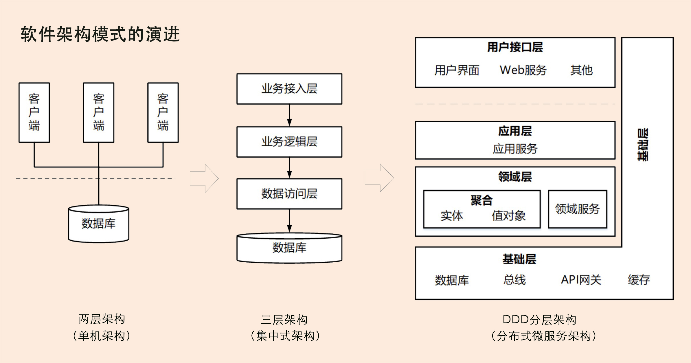

### 微服务架构
### 1. 总体介绍

软件架构模式演进的三个阶段：
1，**单机架构：**采用面向过程的设计方法，系统包括客户端 UI 层和数据库两层，采用 C/S 架构模式，整个系统围绕数据库驱动设计和开发，并且总是从设计数据库和字段开始。
2，**集中式架构：**采用面向对象的设计方法，系统包括业务接入层、业务逻辑层和数据库层，采用经典的三层架构，也有部分应用采用传统的 SOA 架构。这种架构容易是系统变得臃肿，可扩展性和弹性伸缩差。
3，**分布式微服务架构：**以业务流程提炼为领域模型，驱动设计和模块开发，在一个领域中包含 model 对象、仓储数据、服务实现，也更注重设计模式的使用。

### 2. DDD 分层架构

- 传统的四层架构中，基础层十倍其它层依赖的。采用了依赖倒置的设计后，实现了各层对基础层的解耦。

DDD 各层的主要职责：
- **用户接口层：**负责向用户显示信息和解释用户指令。这里的用户可能是：用户、程序、自动化测试和批处理脚本等；
- **应用层：**可以协调多个聚合的服务和领域对象完成服务编排和组合，协作完成业务操作；
- **领域层：**实现企业核心业务逻辑，包含聚合根、实体、值对象、领域服务等领域模型中的领域对象；
- **基础层：**为其他各层提供通用的技术和基础服务，包括第三方工具、驱动、消息中间件、网关、缓存以及数据库等。

架构根据耦合的紧密程度可以分为：严格分层架构和松散分层架构。
- 严格分层架构：任何层只能对位于其直接下方的层产生依赖；
- 松散分层架构：允许某层与其任意下方的层发生依赖。

#### 2.1 MVC 三层架构演进到 DDD 分层架构

### 3. 整洁架构，又称洋葱架构

- 整洁架构最主要的原则是依赖原则，它定义了各层的依赖关系，越往里依赖越低，代码级别越高，越是核心能力。
  - 外圆代码依赖只能指向内圆，内圆不需要知道外圆的任何情况；
  - 从里到外依次是领域模型、领域服务、应用服务和最外围的容易变化的内容，比如用户界面和基础设施。

### 4. 六边形架构，又称端口适配器架构

- 核心理念是：应用是通过端口与外部进行交互的。
- 六边形架构将系统分为内六边形和外六边形两层：
  - 内六边形实现应用的核心业务逻辑；
  - 外六边形完成外部应用、驱动和基础资源等的交互和访问，对前端应用以 API 主动适配的方式提供服务，对基础资源以依赖倒置被动适配的方式实现资源访问。

### 2. CQRS 架构
- [CQRS 模式](https://learn.microsoft.com/zh-cn/azure/architecture/patterns/cqrs)

 

**参考资料：**
- [DDD 实战](https://zq99299.github.io/note-book2/ddd/)
