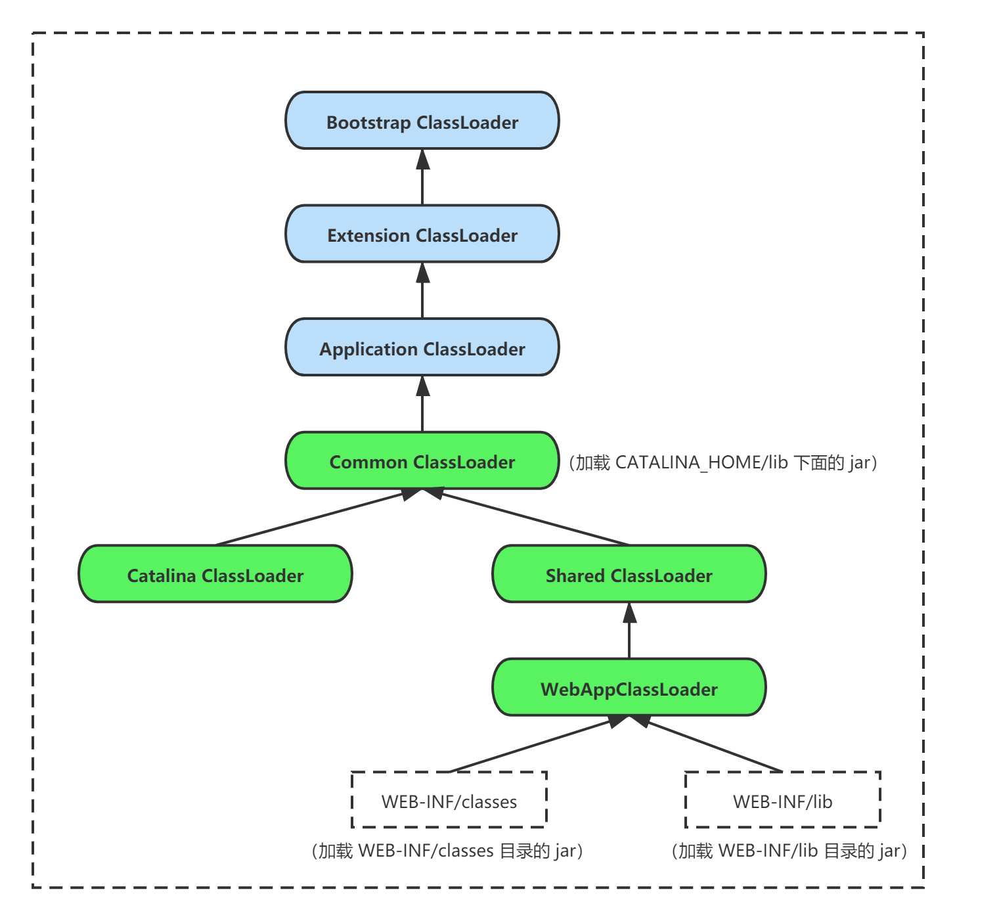

### 类加载机制深度解读

#### 1，JVM 类加载机制
- `BootStrapClassLoader` 是由 C++ 实现的，并不是继承自 `java.lang.ClassLoader`，没有对应的 Java 对象，举例来说，`java.lang.String` 是由启动类加载器加载的，而`String.class.getClassLoader()`就会返回 null；
- `ExtClassLoader` 和 `AppClassLoader` 是 `sun.misc.Launcher` 的内部类，均继承自 `java.net.URLClassLoader`，`URLClassLoader` 继承自抽象类 `java.lang.ClassLoader`；
  - 每个 `ClassLoader` 都持有一个 `parent` 字段，指向父加载器，这个 `parent` 字段从 `java.lang.ClassLoader` 继承而来；
  - `findClass` 方法查找的路径不同，导致了类加载器的加载路径不同；
- `java.lang.ClassLoader` 中的三个方法：
  - `defineClass`：调用 native 方法把 Java 类的字节码解析成一个 Class 对象；
  - `findClass`：把来自文件系统或网络的 ".class" 文件读取到内存，得到字节码数组，然后调用 `defineClass` 方法得到 Class 对象；
  - `loadClass`：默认按照双亲委派模型来加载类，具体加载过程如下：
    - 调用 `findLoadedClass(name)` 检查类是否已经被加载过；若没有，则继续；
    - 若 `parent` 属性的值不为 null，根据双亲委派模型，调用 `parent.loadClass(name, false)`，优先从 parent 中执行 loadClass；
	- 若 `parent` 属性的值为 null，则调用`findBootstrapClassOrNull(name)`判断是否在 `BootStrapClassLoader` 中加载过；
	- 如果类仍未找到，则执行 `findClass` 查找类，`findClass` 由 ClassLoader 的子类实现；
- 自定义 ClassLoader，是通过继承 `java.lang.ClassLoader` 抽象类，重写以下方法：
  - 如果希望**遵循**双亲委派模型，覆写 `findClass()` 方法；
  - 如果希望**打破**双亲委派模型，覆写 `loadClass()` 方法；

#### 2，Tomcat 的类加载器
- Tomcat 的自定义类加载器 `WebappClassLoaderBase` 通过继承 `URLClassLoader`，重写 `findClass` 和 `loadClass` 两个方法，打破了双亲委派机制，其目的是优先加载 Web 应用自己定义的类，如果找不到,则交给父类加载器(AppClassLoader)；
- `findClass` 方法步骤：
  - 先在 Web 应用目录查找要加载的类；
  - 如果没有找到，交给父类加载器(AppClassLoader)去查找；
  - 如果父类加载器也没有找到，则抛出 `ClassNotFoundException`；

- `loadClass` 方法步骤：
  - 先在本地缓存查找该类是否已经加载过，即 Tomcat 的类加载器是否已经加载过这个类；
  - 若没有，则在系统类加载器的缓存中查看是否已经加载过；
  - 如果都没有，则尝试使用 `ExtClassLoader` 去加载，**防止 Web 应用自己的类覆盖 JRE 的核心类**；
  - 如果 `ExtClassLoader` 加载失败，则调用 `findClass` 方法，在本地 Web 应用目录下查找并加载；
  - 如果本地目录下没有这个类，则调用 `Class.forName` 交给系统类加载器去加载，`Class.forName` 的默认加载器就是系统类加载器；
  - 如果上述加载过程全部失败，则抛出 `ClassNotFoundException`；

- Tomcat 的 `org.apache.catalina.startup.Bootstrap` 类
  - `commonClassLoader` 和 `sharedClassLoader` 是组合关系

 

 

**参考资料：**
- [Tomcat 如何打破双亲委派模型](https://time.geekbang.org/column/article/105110)
- [Java 类加载机制深度解析](https://blog.csdn.net/qq_40709026/article/details/107908104)
- [loadClass 执行过程](https://juejin.cn/post/6844904023540105229)
- [Tomcat 的类加载机制](https://blog.csdn.net/a745233700/article/details/120802616)