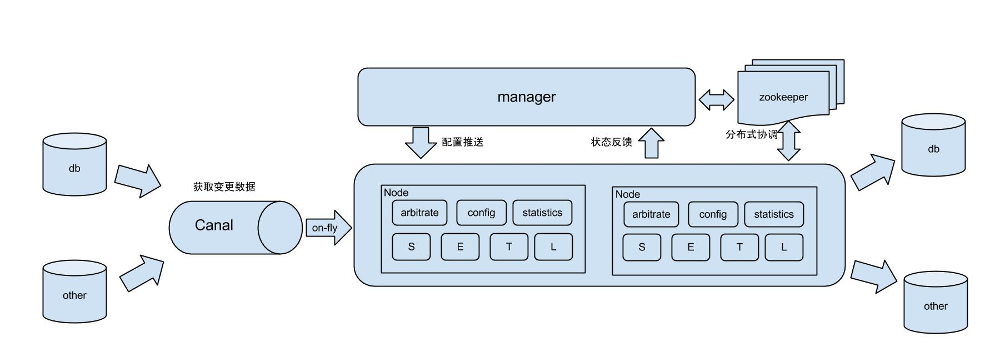
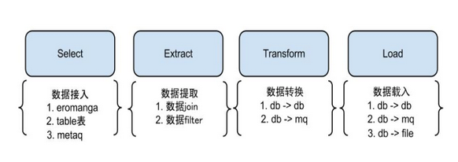
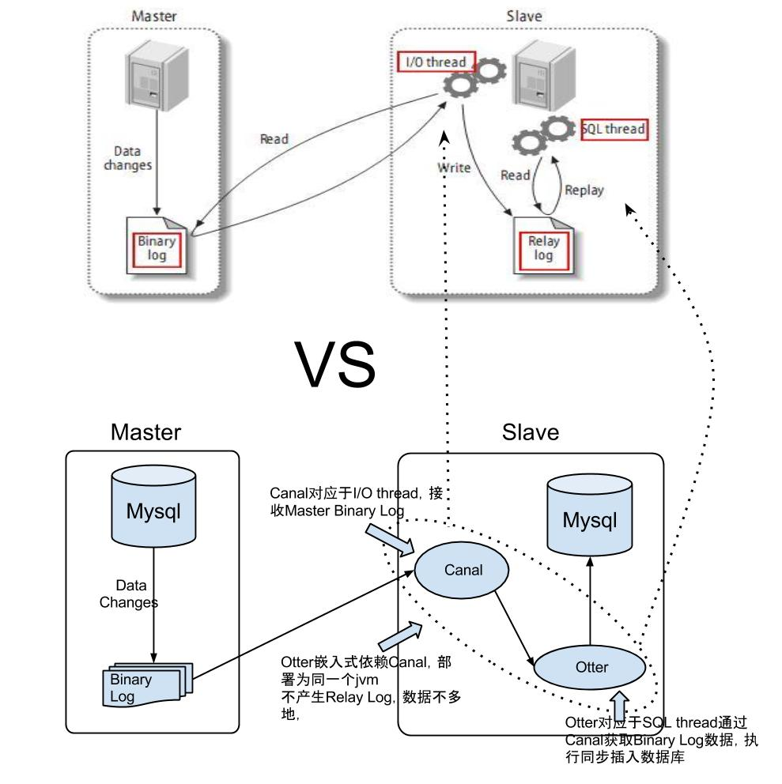

### Canal 和 Otter 的关系
### 1. MySQL 主从复制实现

从图中可以看出，主从复制分为三步：
- master 将改变的记录到 `binlog`；
- slave 将 `binlog` 拷贝到自己的中继日志(`relay log`)；
- slave 重做中继日志中的事件，将改变反映在自己的数据中。

### 2. Canal 工作原理

Canal 主要是基于 MySQL 数据库增量日志解析，提供增量数据订阅和消费。
工作原理：
	- canal 模拟 MySQL slave 的交互协议，伪装自己为 MySQL slave，向 MySQL master 发送 dump 请求；
	- MySQL master 收到 dump 请求，开始推送 binlog 给 slave(即 canal)；
	- canal 解析 binlog；

### 3. Otter 工作原理

原理描述：
1，基于 Canal 开源产品，获取数据库增量日志数据；
2，典型管理系统架构，manager(web 管理) + node(工作节点)
	a. manager 运行时推送同步配置到 node 节点；
	b. node 节点将同步状态反馈到 manager 上；
3，基于 zookeeper，解决分布式状态调度，允许多个 node 节点之间协同工作。

#### 3.1 otter 的 S/E/T/L stage 阶段模型

### 4. Canal 和 Otter 区别

基于 canal & otter 的复制技术和 mysql 复制类似，具有类比性：
1，Canal 对应于 I/O thread，接收 Master Binary Log；
2，Otter 对应于 SQL thread，通过 Canal 获取 Binary Log 数据，执行同步插入数据库；

两者区别在于：
1，Otter 目前嵌入式依赖 Canal，部署为同一个 JVM，目前设计为不产生 Relay Log，数据不落地；
2，Otter 目前允许自定义同步逻辑，解决各类需求：
	a. ETL 转化，比如 Slave 目标表上的表名、字段名、字段类型不同，字段个数不同等；
	b. 异构数据库，比如 Slave 可以是 oracle 或者其他类型的存储，nosql 等；
	c. 基于 manager 部署，方便监控同步状态和管理同步任务。

 

**参考资料：**
- [Canal wiki](https://github.com/alibaba/canal/wiki)
- [Otter 常见问题](https://github.com/alibaba/otter/wiki/Faq)