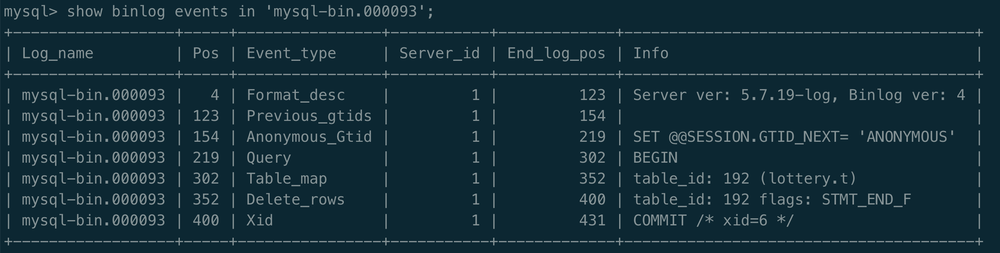

### 高级 Java 技术面试总结
- 主动复习策略：**只看标题，自己脑子里面进行回答**，不仅能调动积极性，也不至于昏昏欲睡，并且复习速度也更快。
- 多动笔写写，手写的比使用电脑记录内容，记忆程度更深；


### 0. 目录
1. [Java 基础](#1)
2. [JVM 相关](#2)
3. [Java 集合](#3)
4. [并发编程](#4)
5. [Spring](#5)
6. [MySQL](#6)
7. [Redis](#7)
8. [ElasticSearch](#8)
9. [消息队列(kafka)](#9)
10. [Dubbo](#10)
11. [设计模式](#11)
12. [算法](#12)
13. [领域驱动设计(DDD)](#13)
14. [系统设计相关](#14)

### 1. <span id="1">Java 基础</span>
1.1 八种基本数据类型：
  - `byte`，`short`，`int`，`long`，`float`，`double`，`boolean`，`char`

1.2 面向对象的三大特性：
  - 封装，继承，多态

1.3 多态的三个前提：
  - 两个类要有继承关系；
  - 子类要重写父类方法；
  - 父类引用指向子类；

1.4 接口与抽象类区别：
  - 一个类只能继承一个抽象类，但可以实现多个接口；
  - 抽象类可以提供成员方法的实现细节；接口中只能存在 `public abstract` 方法；
  - 抽象类中的成员变量可以是各种类型的；接口中的成员变量只能是 `public static final` 类型的；
  - 抽象类中可以有静态代码块和静态方法；接口中不能含有静态代码块及静态方法；

1.5 `final` 关键字
- 被 final 修饰的类不能被继承；
- 被 final 修饰的方法不能被覆盖重写；
- 被 final 修饰的成员变量，表示常量，只能被赋值一次，赋值后值不再改变，而且必须显式赋值；
- 被 final 修饰的局部变量(参数列表和方法内局部变量)，表示不可再更改；
- 安全发布，当创建一个对象时，使用 final 关键字能够使得另一个线程不会访问到处于“部分创建”的对象；

1.6 异常分类
- Error：`StackOverfowError`、`OutOfMemoryError`
- `java.lang.RuntimeException` 是 unchecked exception，子类包括：
  - `NullPointerException`、`ClassCastException`、`ArithmeticException`、`IndexOutOfBoundsException`；
- checked exception 是从 `java.lang.Exception` 衍生出来，非 `RuntimeException` 的子类异常，包括：
  - `IOException`、`ClassNotFoundException`、`SQLException`；
  - checked exception 在定义方法时，必须声明所有可能会抛出的 checked exception;
  - 在调用这个方法时，必须捕获它的 checked exception；

### 2. <span id="2">JVM 相关</span>
2.1 JVM 内存布局
- 按照线程是否共享来分类：


- 堆的默认空间分配
  - `-Xms`: memory start；
  - `-Xmx`: memory max；


2.2 判断对象是否存活
- 可达性分析：从 GC Roots 为起点开始向下搜索，搜索所走过的路径称为引用链。当一个对象到 GC Roots 没有任何引用链相连时，则证明此对象是不可用的，可以被回收。

2.3 Java 中的引用
- 强引用（Strong Reference）：如果一个对象 GC Roots 可达，强引用不会被回收；
- 软引用（Soft Reference）：当 JVM 认为内存不足时，会清理软引用指向的对象；通常用来实现内存敏感的缓存；
- 弱引用（Weak Reference）：无论内存是否充足，都会回收跟弱引用关联的对象；
- 虚引用（Phantom Reference）：虚引用不会对对象生存时间构成影响，只是为了在这个对象被收集器回收时收到一个系统通知；

2.4 GC 算法
- 标记-清除算法(Mark-Sweep)：会产生大量不连续的内存碎片；
- 标记-复制算法(Coping)：每次是对整个半区进行内存回收，缺点：可用内存缩小到原来的一半；
- 标记-压缩算法(Mark-Compact)：能够解决内存碎片化问题，但压缩算法的性能开销也不小；

2.5 垃圾回收器：
- 新生代：ParNew + 老年代：CMS
  - 启用 CMS 收集器：`-XX:+UseConcMarkSweepGC`
- CMS 运行过程：
  - 初始标记 -> 并发标记 -> 重新标记 -> 并发清除
  - 特点：并发收集，低停顿；
- G1 垃圾收集器
  - 将连续的堆内存划分为多个大小相等的 Region，可以通过参数`-XX:G1HeapRegionSize`设置，取值范围为 `1M ~ 32M`；
  - H 区：专门用来存储大对象；只要超过 Region 容量一半的对象即可判定为大对象；
  - 根据允许的收集时间，优先回收价值最大的 Region，避免 Full GC；
  - 使用 Remembered Set(记忆集) 避免全堆作为 GC Roots 扫描；
    - RSet 用于记录和维护 Region 之间的对象引用关系；用于记录其他 Region 中的对象引用本 Region 中对象的关系；
  - Collection Set(CSet)：记录了等待回收的 Region 集合；

2.6 JVM 调优
- JVM 调优的目的：尽量减少停顿时间，提高系统的吞吐量；
- 触发 Full GC 的情况：
  - 老年代空间不足，产生 Concurrent mode failure 或 promotion failed
    - Young GC 时，晋升老年代内存平均值大于老年代剩余空间；
    - Survivor 空间不足，Survivor 中对象还不足以晋升到老年代，从年轻代晋升到 Survivor 的对象大于 Survivor 剩余空间；
  - 元空间不足，扩容导致 STW 的 Full GC；
  - 有连续的大对象需要分配；
- 解决方案：
  - 老年代空间不足：
    - 增加新生代和老年代的内存；
    - 由于 Concurrent mode failure 发生后，CMS GC 会退回到 Serial Old GC，导致停顿时间延长；因此需要尽早执行 CMS GC，调低触发 CMS GC 执行的阈值：`-XX:CMSInitiatingOccupancyFraction = 68%`，默认值为 92%；
  - 元空间不足：
    - 配置：`-XX:MetaspaceSize=128 -XX:MaxMetaspaceSize=128`；
    - 元空间初始大小为 20.75M；

2.7 CPU 经常 100%，排查步骤：
- `top`：查看系统 CPU 的占用情况；
- `top -Hp [java 系统的 pid]`：查看该进程下各个线程 CPU 和内存占用情况；
- `jstack [进程号] | grep [线程号]`：查看线程栈情况
  - 如果结果中存在 `VM Thread`，则表示当前线程是垃圾回收的线程，也基本上可以确定，当前系统缓慢的原因主要是垃圾回收过于频繁，导致 GC 停顿时间较长；
- `jstat -gcutil [pid] 1000 10`：监测 GC 回收频率；

2.8 内存泄漏相关
- 定义：内存泄漏，是指程序内动态分配的堆内存由于某种原因程序未释放或者无法释放，导致系统内存浪费，程序运行速度变慢甚至系统崩溃等严重后果；
- 内存泄漏的表现：
  - 发生 OOM 错误；
  - 请求响应时间变长，因为频繁发生 Full GC，暂停其他业务线程(Stop The World)造成的；
- 方案：
  - 运行参数配置：`-XX:+HeapDumpOnOutOfMemoryError -XX:+HeapDumpPath=${指定 dump 文件的目录}`；
  - 使用 VisualVM 工具分析 dump 出的内存快照，定位主要是什么对象比较消耗内存，优化相关代码；

### 3. <span id="3">Java 集合</span>
3.1 String，StringBuilder 和 StringBuffer
- StringBuilder 可变，线程不安全；
- StringBuffer 可变，线程安全，内部方法使用了 synchronized 锁；
- String 不可变
  - String 类中真正存储字符的地方是 `private final char value[];`，被 final 修饰；
  - String 类被 final 修饰，不可继承；
  - String 源码中涉及到到 char 数组进行修改的操作全部都会重新创建一个 String 对象；

3.2 ArrayList 和 LinkedList
- ArrayList 基于动态数组，LinkedList 基于链表；
- 对于随机 index 访问，ArrayList 优于 LinkedList，ArrayList 可以直接通过数组下标找到元素；
- 新增和删除元素，LinkedList 由于 ArrayList，在新增或删除元素时，ArrayList 可能需要**扩容和复制**数组，而 LikedList 只需要修改指针即可；

3.3 CopyOnWriteArrayList
- 核心概念：读写分离，空间换时间；利用 CopyOnWrite（写时复制） 思想，在写时复制一份副本进行修改，修改完成后，再将新值赋给旧值；
- CopyOnWrite 的问题：
  - 内存占用问题：CopyOnWrite 因为复制副本，所以占用双倍内存，可能造成频繁的 Young GC 和 Full GC；
  - 数据一致性问题：CopyOnWrite 只保证了数据最终一致性，无法保证数据实时一致性；
- CopyOnWrite 适用场景：
  - 适合读多写少，且复制的对象不宜过大；
  - 添加、删除元素时，尽量使用 `addAll` 或 `removeAll` 批量添加(或删除)；

3.4 foreach 循环里面为什么不能进行元素的 `add/remove` 操作？
- 反编译 foreach 生成的 `.class` 文件，会发现增强 for 循环，底层依赖 `while` 循环和 `Iterator` 实现；
- 增强 for 循环，集合的遍历是通过 `Iterator` 进行的；
- 集合元素的 `add/remove` 操作，是通过 ArrayList 或 LinkedList 的 `add/remove` 方法，其源码中会调用 `modCount++`；
- 通过 `Iterator` 迭代时，每次调用 `next()` 方法，都会调用 `checkedForModification()` 方法，检查集合在遍历过程中是否被修改，如果 `modCount != expectedModCount`，会抛出 `ConcurrentModificationException`；
- **根本原因**：ArrayList 自带的 `add/remove` 方法不会去更新 Iterator 自身的 `expectedModCount` 值；
  - `fail-fast`，快速失败机制，当在迭代集合的过程中，集合元素发生变化时，就可能抛出 `ConcurrentModificationException`；
- 优化：`remove` 元素使用 Iterator 方式，使用 Iterator 的 `add/remove` 方法，除了调用对应集合的 `add/remove` 方法，还会修改自身的 `expectedModCount`；

<details>
<summary>反编译的 foreach 文件</summary>

```java
// 增强 for 循环
public static void main(String[] args) {
    List<String> list = new ArrayList<>();
    list.add("a");
    list.add("b");
    for(String item : list) {
        if ("b".equals(item)) {
            list.remove(item);
        }
    }
}

// IDEA 查看反编译后结果：
public static void main(String[] var0) {
    ArrayList var1 = new ArrayList();
    var1.add("a");
    var1.add("b");
    Iterator var2 = var1.iterator();

    while(var2.hasNext()) {
        String var3 = (String)var2.next();
        if ("b".equals(var3)) {
            var1.remove(var3);
        }
    }
}
```
</details>

3.5 HashMap
- 数据结构：数组 + 链表 + 红黑树；
- 扰动函数：优化散列效果，增加随机性，减少哈希碰撞；
- 初始化大小为 16；
- 负载因子：0.75，当阈值容量占了 3/4 时，就需要进行扩容，减少哈希碰撞；
- 扩容的算法：`e.hash & oldCap == 0`，判断当前节点是否需要移位，若为 0，不需要移动；若为 1，则需要移动至 (oldCap + 扩容容量)的位置；
- 链表转红黑树的条件：
  - 链表长度 >= 8，且存 key 值的数组桶容量大于 64；否则，只会扩容，不会树化；
- 不安全的原因：
  - Java 7：并发扩容时，采用**头插法**，造成链表逆序，容易出现环形链表，造成死循环；
  - Java 8：并发扩容时，采用**尾插法**，但是没有同步锁保护，可能造成数据被覆盖；

### 4. <span id="4">并发编程</span>
4.1 Thread 介绍
- `run()`：Thread 类继承了 `Runnable` 接口，重写了 `run()` 方法；`run()` 方法用于封装需要执行的任务；
- `start()`：用于线程的初始化，调度执行 `run()` 方法封装的任务；
- 创建 Thread 只有一种途径，借助构造方法，`new Thread` 对象；封装任务有两种方式：
  - 继承 Thread，重写 run 方法；
  - 实现 `Runnable` 接口，将实例对象传递给 Thread 构造函数；
  - 实现 `Callable` 接口，和 `FutureTask` 接口；

- `FutureTask` 介绍
  - 异步执行，可执行多次(通过 `runAndReset()` 方法)，也可以仅执行一次(执行 `run()` 方法）；
  - 可获取线程执行结果；

<details>
<summary>`FutureTask` 源码分析</summary>

```java
// FutureTask 的 run() 代码仅执行一次
public void run() {
    /**
     * FutureTask 的 run 方法仅执行一次的原因：
     *   1，state != NEW 表示任务正在被执行或已经执行完成，直接返回；
     *   2，若 state == NEW，则尝试 CAS 将当前线程设置为执行 `run()` 的线程，若设置失败，说明已经有其他线程在执行该任务了，当前线程退出；
     */
    if (state != NEW ||
        !UNSAFE.compareAndSwapObject(this, runnerOffset,
                                      null, Thread.currentThread()))
        return;
    try {
        Callable<V> c = callable;
        if (c != null && state == NEW) {
            V result;
            boolean ran;
            try {
                result = c.call();
                ran = true;
            } catch (Throwable ex) {
                result = null;
                ran = false;
                setException(ex);
            }
            if (ran)
                set(result);
        }
    } finally {
        // runner must be non-null until state is settled to
        // prevent concurrent calls to run()
        runner = null;
        // state must be re-read after nulling runner to prevent
        // leaked interrupts
        int s = state;
        if (s >= INTERRUPTING)
            handlePossibleCancellationInterrupt(s);
    }
}

// FutureTask 如何拿到线程执行的结果：
//   - 主要依赖 FutureTask 类内部的 Callable 属性；

// FutureTask 可能得执行过程：
//  顺利完成：NEW -> COMPLETING -> NORMAL
//  异常退出：NEW -> COMPLETING -> EXCEPTIONAL
//  被取消：  NEW -> CANCELLED
//  被中断：  NEW -> INTERRUPTING -> INTERRUPTED
```
</details>

4.2 Thread 状态
- Runnable 状态包含 Ready、Running 两种状态；
  - Ready：等待操作系统分配 CPU 时间片；
  - Running：正在占用 CPU 运行；


4.3 `wait`、`sleep`、`join` 方法区别：
- `wait` 和 `sleep` 都会使线程进入阻塞状态，都是可中断方法，被中断后，会抛出 `InterruptedException`；
- `wait` 是 Object 方法，`sleep` 是 Thread 方法；
- `wait` 必须在同步方法(或同步代码块，`synchronized`)中使用，`sleep` 不需要；
- `wait` 会释放锁，`sleep` 不会释放锁；
- `join` 是 Thread 中的 synchronized 修饰的方法，里面调用了 `wait` 方法，让持有当前同步锁的线程进入等待状态，也就是主线程，当子线程执行完毕后，JVM 会调用 `lock.notifyAll(thread)` 方法，唤醒主线程继续执行；

4.4 `ThreadLocal`
- Thread 类有一个类型为 `ThreadLocal.ThreadLocalMap` 的实例变量 `threadLocals`，每个线程在往 `ThreadLocal` 里面放值时，都是往线程的 `ThreadLocalMap` 里面存，key 为 `ThreadLocal` 的一个弱引用；
- 使用 `ThreadLocal` 一定要记得执行 `new ThreadLocal<>().remove()` 方法，避免在发生 GC 后，弱引用 key 被回收，导致内存泄漏；
- **ThreadLocal 内存泄漏：** `ThreadLocalMap` 的生命周期和 Thread 一样长，当一个 ThreadLocal 的所有强引用都被移除后，但绑定了对应信息的线程还存在时，触发 GC 后，对应的 key 会被回收置为 null，而 value 还存在于内存中，但无法访问；

```java
// ThreadLocalMap 中的 Entry 类
static class Entry extends WeakReference<ThreadLocal<?>> {
    /** The value associated with this ThreadLocal. */
    Object value;
    Entry(ThreadLocal<?> k, Object v) {
        super(k);
        value = v;
    }
}
```


4.5 内存模型(JMM，Java Memory Model)
- 主内存：所有线程共享；
- 工作内存：线程私有部分；


4.6 线程安全问题，主要分为三类
- 原子性、可见性、有序性

- 原子性：多个操作作为一个整体，要么全部执行，要么不执行；
  - 锁机制：锁具有排他性，它能保证一个共享变量在任意一个时刻仅仅被一个线程访问；
  - 借助于处理器提供的 CAS 指令；
- 可见性：如果一个线程对某个共享变量进行更新之后，后续访问该变量的线程可以读到更新后的结果，则称为这个线程对该共享变量的更新对其他线程可见；
- 有序性：重排序是对内存访问操作的一种优化，它可以在不影响单线程程序正确的前提下，进行一定的调整，进而提高程序的性能；
  - `As-if-Serial Semantics`：貌似串行语义，从单线程的角度保障不会出现问题，但是对于多线程就可能出现问题；

4.7 `volatile`
- `volatile` 通过**内存屏障**来保证可见性、有序性以及自身修饰变量的原子性，但是不能保障代码段的原子性，是一种弱同步；
  - 当一个线程对 `volatile` 修饰的变量进行写操作时，JMM 会把最新值刷新到主内存；
  - 当一个线程对 `volatile` 修饰的变量进行读操作时，JMM 会把该线程对应的本地内存置为无效，从主内存中读取最新的值；

4.8 `synchronized`
- JVM 层面的悲观锁；
- 底层依赖监视器(Monitor)，监视器又依赖操作系统的互斥锁；
- 锁升级：无锁、偏向锁、轻量级锁、重量级锁、GC 标记；


- 锁的执行：`EntryList`、`WaitSet`；


- 同步方法：`ACC_SYNCHRONIZED` 同步标识；
- 同步代码块：`monitorenter`、`monitorexist` 两条指令；
- 静态同步方法，锁对象为类；普通同步方法，锁对象为实例对象；
- 可重入特性：
  - 当前线程获得锁后，通过cas将`_owner`指向当前线程，若当前线程再次请求获得锁， `_owner`指向不变，执行`_recursions++`记录重入的次数，若尝试获得锁失败，则在`_EntryList`区域等待。

4.9 `synchronized` 和 `Lock` 对比
- `synchronized` 是 JVM 底层实现的，`Lock` 是 JDK 接口层面的；
- `synchronized` 是隐式的，`Lock` 是显式的，需要手动加锁和解锁；
- `synchronized` 无论如何都会释放，即使出现异常；`Lock` 需要自己保障正确释放；
- `synchronized` 是阻塞式获取锁，`Lock` 可以阻塞获取，可中断，还可以尝试获取，还可以设置超时等待获取；
- `synchronized` 无法判断锁的状态，`Lock` 可以判断锁的状态；
- `synchronized` 可重入，不可中断，非公平；`Lock` 可重入，可中断，可配置公平性(公平和非公平都可以)；
- 如果竞争不激烈，两者的性能都差不多的，可是 `synchronized` 的性能还在不断的优化；当竞争资源非常激烈时（即有大量线程同时竞争），此时`Lock`的性能要远远优于`synchronized`；

4.10 `AbstractQueuedSynchronizer`(AQS)
- AQS 基于 CLH 变体的虚拟双向队列；
- `volatile int state`：代表共享资源的状态，`state = 1` 代表当前对象锁已被占有，其他线程来加锁会失败；加锁失败的线程会被放入一个 FIFO 等待队列中，`UNSAFE.park()`方法阻塞当前线程；
- 通过 CAS 来保证 `state` 并发修改的安全性；
- `thread`：当前占有锁的线程；
- 锁的模式：独占锁、共享锁；
- `waitStatus`：CANCELLED、SIGNAL、CNODITION、PROPAGATE、0(默认值)；

4.11 `CountDownLatch` 和 `CyclicBarrier`
- `CountDownLatch` 可以当作一个计数器来使用，比如主线程等待所有子线程都执行过某个时间点后，才能继续执行；
  - `CountDownLatch` 利用 AQS 的共享锁来进行线程的通知，`await` 方法等待 Latch 达到 0 或被中断，抛出异常后，才会被执行，即依次唤醒队列中的节点；
- `CyclicBarrier`：所有线程从同一时间点开始执行；
  - `CyclicBarrier` 利用 `ReentrantLock` 中的 `Condition` 来阻塞和通知线程；等到线程数增长到指定数量后，调用 `Condition.signalAll()` 唤醒所有线程；

4.12 锁的分类
a. 乐观锁与悲观锁
- 乐观锁认为自己在使用数据时，不会有别的线程修改数据，所以不会加锁，使用处理器提供的 CAS 指令来实现；
  - CAS 算法涉及到三个操作数：
    - 要读写的内存值 V；
    - 进行比较的值 E(预期值)；
    - 要写入的新值 N；
    - 当 `V == E` 时，用 N 更新 V；
  - CAS 算法的三个问题：
    - ABA 问题，可以使用时间戳或版本号解决；
    - 循环时间长开销大；
    - 只能保证一个共享变量的原子操作；
- 悲观锁认为自己在使用数据的时候，一定有别的线程来修改数据，因此在获取数据之前先加锁:
  - `synchronized` 或 `ReentrantLock`；

b. 公平锁与非公平锁
- 非公平锁：多个线程加锁时，直接尝试加锁，获取不到才会进入等待队列的队尾等待；
- 公平锁：是通过同步队列来实现多个线程按照申请锁的顺序来获取锁，从而实现公平性；
  - 公平锁的 `lock` 方法会调用 `hasQueuedPredecessors()` 方法，即判断当前线程是否位于同步队列中的第一个；
- 优缺点：
  - 公平锁不会产生线程饥饿，CPU 唤醒阻塞线程的开销会比非公平锁大，所以整体吞吐率比非公平锁低；
  - 非公平锁减少唤起线程的开销，整体的吞吐率高，但有可能产生线程饥饿，即等待队列中的线程一直获取不到锁；

c. 独占锁与共享锁
- 独占锁：是指该锁一次只能被一个线程所持有；`ReentrantLock` 是独占锁；
- 共享锁：是指该锁可被多个线程所持有；`ReentrantReadWriteLock` 是共享锁；

d. 可重入锁
- 可重入锁，是指在同一个线程在外层方法获取锁的时候，再进入该线程的内层方法会自动获取锁（前提锁对象得是同一个对象或者class），不会因为之前已经获取过还没释放而阻塞。`ReentrantLock`和`synchronized` 都是可重入锁，可重入锁的一个优点是可一定程度避免死锁。

e. 自旋锁
- 当前线程获取锁时，如果发现锁已经被其他线程占有，并不会马上阻塞自己，在不放弃 CPU 的情况下，多次尝试；自旋等待虽然避免了线程切换的开销，但是以浪费 CPU 为代价；

4.13 线程池
4.13.1 `Executors` 创建线程池的弊端：
- `FixedThreadPool` 和 `SingleThreadPool`：允许请求队列长度为 `Integer.MAX_VALUE`，可能会堆积大量请求，造成 OOM；
- `CachedThreadPool` 和 `ScheduledThreadPool`：允许创建的线程数量为 `Integer.MAX_VALUE`，可能会创建大量的线程，造成 OOM；

4.13.2 `ThreadPoolExecutor` 六大核心参数：
- `corePoolSize`：核心线程数；
- `maximumPoolSize`：最大线程数；
- `keepAliveTime`：空闲线程存活时间；
- `timeUnit`：时间单位；
- `workQueue`：存放待执行任务的队列；
- `handler`：当线程池线程数已满，且工作队列达到饱和，新提交的任务使用拒绝策略处理；
  - `AbortPolicy`：丢弃任务并抛异常，默认拒绝策略；
  - `DiscardPolicy`：丢弃任务但不抛异常；
  - `DiscardOldestPolicy`：丢弃队列最前面的任务，然后重新提交被拒绝的任务；
  - `CallerRunsPolicy`：由调用线程（提交任务的线程）处理该任务，从而降低新任务的流量；
- 动态调参：支持线程池参数动态调整，包括修改 `corePoolSize`、`maximumPoolSize`、`workQueue`；参数修改后及时生效；
- 增加线程池监控：包括线程池的任务执行情况、最大任务执行时间、平均任务执行时间等；

4.13.3 `Worker` 内部类
- `Worker` 内部类通过继承 AQS 来实现非公平，独占，不可重入锁；
- 通过 `Worker` 内部类可以掌握线程的运行状态，维护线程的生命周期；
  - `lock` 方法获取不到锁，表示当前线程正在执行任务中，不应该中断；
  - 线程池在执行 `shutdown` 方法或 `tryTerminate` 方法时，会调用 `interruptIdleWorkers` 方法来中断空闲的线程，`interruptIdleWorkers` 方法会使用 `tryLock` 方法来判断线程池中的线程是否是空闲状态；
  - Java 借助**中断机制**来停止一个线程：`public void interrupt();`；

```java
private final class Worker extends AbstractQueuedSynchronizer implements Runnable {
  final Thread thread;

  Runnable firstTask;
}
```

### 5. <span id="5">Spring</span>
5.1 SpringMVC 流程图


5.1.1 拦截器和过滤器
- 拦截器：`org.aopalliance.intercept.Interceptor`，过滤器：`javax.servlet.Filter`；
- 实现原理不同：拦截器是基于 java 的反射机制，而过滤器是基于函数回调；
- 拦截器不依赖于 servlet 容器，过滤器则依赖 servlet 容器；
- 拦截器只能对 action 请求起作用，而过滤器则可以对几乎所有的请求起作用；
- 在 action 的生命周期中，拦截器可以多次被调用，而过滤器只能在容器初始化时被调用一次；

5.2 `BeanFactory` 和 `ApplicationContext` 区别
- `BeanFactory` 是 Spring 容器最核心也是最基础的接口，用于管理 bean 的工厂，最核心的功能是加载 bean，即 `getBean` 方法，包含了各种 Bean 的定义，负责 Bean 的生命周期(读取配置文件，加载，实例化)，维护 bean 之间的依赖关系；
- `ApplicationContext` 接口继承了 `BeanFactory` 接口，除了提供 `BeanFactory` 所具有的功能外，还提供了更完整的框架功能：国际化、统一的资源文件访问方式(`ResourceLoader` 接口)、事件驱动机制(`ApplicationEventPublisher`接口)等；

5.3 `BeanFactory` 和 `FactoryBean` 的区别：
- `BeanFactory` 是 IOC 最基本的容器，负责生产和管理 bean，提供了一个 Spring IOC 容器规范，`DefaultListableBeanFactory`、`XmlBeanFactory`、`ApplicationContext` 等具体的容器都实现了 `BeanFactory`；
- `FactoryBean`：工厂 bean，实现该接口的类可以自定义想要创建的 bean 实例，`FactoryBean#getObject`返回一个代理类，在代理类中可以实现自定义逻辑，如自定义的监控、限流等等；

5.4 动态代理
- JDK 动态代理，只能基于接口进行代理，通过反编译，可以发现代理类继承自 Proxy;
- Cglib 代理：基于 ASM 字节码，在运行时对字节码进行修改和动态生成，通过继承的方式进行代理，无论对象有没有实现接口，都可以进行代理；

5.5 控制反转(Inversion of Control, IOC)
- 由 Spring 来负责控制对象的生命周期，`@ComponentScan` 定义扫描包路径，将 `@Component`、`@Controller`、`@Service`、`@Repository` 等注解的类加载到 Spring 容器；
  - `@Component` 是通用注解，其他三个注解是这个注解的衍生注解；
  - `@Controller` 是 SpringMVC 注解，用于控制层；
  - `@Service` 用于业务逻辑层；
  - `@Repository` 用于持久层，标注 DAO 类；

- `@Configuration` 和 `@Component` 区别：
  - `@Configuration` 本质上还是 `@Component`，`@Configuration` 中所有带 `@Bean` 注解的方法都会被动态代理，调用该方法返回的都是同一个实例对象；
  - `@Component` 修饰的类，每次都会创建一个新的对象返回；

5.6 依赖注入(Dependency Injection, DI)
- 依赖注入，常见 3 种方式：
  - 属性注入
  - Setter 注入
  - 构造方法注入

- `@Autowired` 和 `@Resource` 用于维护 bean 之间的依赖关系；
  - 相同点：
    - `@Autowired` 和 `@Resource` 都是作为 bean 对象注入的时候使用；
    - 两者都可以声明在字段和 setter 方法上；
  - 不同点：
    - `@Autowired` 是 spring 提供的，`@Resource` 是 J2EE 提供的；
    - `@Autowired` 注入的对象需要在 IOC 容器种存在，否则需要加上属性 `required = false`，表示忽略当前要注入的 bean；
    - 注入方式：
      - `@Autowired` 默认是 byType 方式注入，可以配合 `@Qualifier` 注解来显示指定 name 的值；
      - `@Resource` 默认是 byName 方式注入，如果没有匹配，则通过 byType 注入；`@Resource` 还有两个重要的属性：name 和 type，用来显示指定 byName 和 byType 方式注入；

5.7 Bean 生命周期
- 概述


- 整体描述


5.7.1 `BeanDefinition`
- `BeanDefinition` 接口用于描述 bean 的元信息，包含 bean 的类信息(全限定类名 beanClassName)、属性（作用域、描述信息）、依赖关系等；**主要目的**是允许 `BeanFactoryPostProcessor` 拦截修改属性值和其他 bean 的元数据；
  - `AbstractBeanDefinition`：抽象类，默认实现了 `BeanDefinition` 中的绝大部分方法；
  - `GenericBeanDefinition`：相比 `AbstractBeanDefinition`，新增 `parentName` 属性，可以灵活设置 parent bean definition；
  - `ScannedGenericBeanDefinition`：通过 `@Component`、`@Controller`、`@Service` 等方式注解的类，会以 `ScannedGenericBeanDefinition` 的形式存在；
  - `AnnotatedGenericBeanDefinition`：借助于 `@Import` 导入的 bean；
- `BeanDefinitionRegistry` 是维护 `BeanDefinition` 的注册中心，它内部存放了 IOC 容器中的 bean 定义信息。它的实现类有 `DefaultListableBeanFactory`；

5.7.2 spring 中的常见扩展点
- `BeanFactoryPostProcessor`：在 `BeanDefinition` 加载完成之后，未实例化之前，定制化修改 `BeanDefinition`；
- `BeanPostProcessor`：在 bean 的初始化阶段前后添加自定义处理逻辑，例如 AOP 通过 `AbstractAutoProxyCreator#postProcessAfterInitialization` 方法生产代理 bean 等；

5.7.3 spring 与 Mybatis 整合
- `MapperScannerConfigurer` 扫描注册 basePackage 包下的所有 bean，并将对应的接口类型改造为 `MapperFactoryBean`；
  - `MapperFactoryBean` 继承了 `SqlSessionDaoSupport` 类，`SqlSessionDaoSupport` 类继承 `DaoSupport` 抽象类，`DaoSupport` 抽象类实现了 `InitializingBean` 接口；
  - `MapperFactoryBean` 的出现是为了代替手工使用 `SqlSessionDaoSupport` 或 `SqlSessionTemplate` 编写数据访问对象(DAO)的代码，使用动态代理实现；
- XML 中的 SQL 会被解析并保存到本地缓存中，key 是 SQL 的 namespace + id， value 是 SQL 的封装；
- 当我们调用 DAO 接口时，会走到代理类中，通过接口的全路径名，从步骤 2 的缓存中找到对应的 SQL，然后执行并返回结果；

5.7.2 三级缓存与循环依赖
- 循环依赖分类：
  - 构造器循环依赖：
    - spring 无法解决此类依赖，因为创建 bean 需要使用构造器，当构造函数出现循环依赖时，我们无法创建“不完整”的 bean 实例；
    - 会抛出 `BeanCurrentlyInCreationException`；
  - 赋值属性循环依赖：
    - spring 只支持 bean 在**单例模式（singleton)**下的循环依赖；其他模式下的循环依赖，会抛出 `BeanCurrentlyInCreationException`；
- 解决循环依赖的方式：提前暴露创建中的 bean 实例；
  - 一级缓存 `singletonObjects`：存储所有创建完成的单例 bean；
  - 二级缓存 `earlySingletonObjects`：完成实例化，但未进行属性注入及初始化的对象，即提前暴露的单例缓存，`ObjectFactory` 返回的 `bean`；
  - 三级缓存 `singletonFactories`：生产单例的工厂缓存`ObjectFactory`；
- 使用两级缓存是否可以？
  - 不可以；
  - Bean 的生命周期：`实例化 -> 属性注入 -> 初始化`；
  - 若不使用三级缓存，在对象 A 实例化后，就需要马上为 A 创建代理，然后放入到二级缓存中去，这样，违背了 Spring 中 AOP 与 Bean 的生命周期相结合的设计原则；
  - AOP 与 Bean 的生命周期结合，是通过 `AnnotationAwareAspectJAutoProxyCreator` 这个后置处理器完成的，调用其中的 `postProcessAfterInitialization` 方法，对初始化后的 Bean 完成动态代理；


5.7.3 spring 事务的传播行为
- 支持当前事务：
  - **REQUIRED**：默认，若当前没有事务，则建立一个新事务；若存在事务，直接加入；
  - **SUPPORTS**：若当前有事务，直接加入；若没有事务，以非事务的方式执行；
  - **MANDATORY**：若当前有事务，直接加入；若没有事务，抛异常；
- 不支持当前事务：
  - **REQUIRED_NEW**：新建事务，若当前存在事务，把当前事务挂起；
  - **SUPPORTED**：若当前没有事务，则以非事务的方式操作；若当前存在事务，把当前事务挂起；
  - **NEVER**：若当前没有事务，则以非事务的方式操作；若当前存在事务，抛异常；
- 嵌套事务：
  - **NESTED**：嵌套事务呈现父子事务的概念，父子之间是有关联的，核心思想就是子事务不会独立提交，而是取决于父事务，当父事务提交，子事务才会提交；若父事务回滚，则子事务也回滚；
  - 若当前存在事务，则会在内部开启一个新事务，作为嵌套事务存在；
  - 若当前无事务，则开启新事务，类似`REQUIRED`；
- `REQUIRED_NEW`示例：
  - `aMethod` 调用 `bMethod`，`aMethod` 用 `PROPAGATION_REQUIRED` 修饰，`bMethod` 用 `REQUIRED_NEW` 修饰；
    - `aMethod` 异常，`bMethod` 不会回滚，因为 `bMethod` 开启了独立的事务；
    - 若 `bMethod` 抛出了未捕获异常，且这个异常满足事务回滚规则，`aMethod` 也会回滚，因为这个异常被 `aMethod` 的事务管理机制监测到了；

5.7.4 Spring 事务的实现原理
- Spring 事务的底层实现主要使用的技术：`AOP(动态代理） + ThreadLocal + try/catch`；
  - 动态代理：基本所有要进行逻辑增强的地方都会用到动态代理，AOP 底层也是动态代理实现的；
  - `ThreadLocal`：主要用于线程间的资源隔离，以此实现不同线程可以使用不同的数据源、隔离级别等；
  - `try/catch`：最终是执行 `commit` 还是 `rollback`，是根据业务逻辑处理是否抛出异常来决定；

5.8 SpringBoot 自动装配原理
- SpringBoot 启动时，会执行 `SpringApplication.run()`，`run()` 方法会刷新容器，刷新容器时，会解析启动类上的注解 `@SpringBootApplication`，这是个复合注解，其中有三个比较重要的注解 `@SpringBootConfiguration`、`@ComponentScan`、`@EnableAutoConfiguration`：
  - `@SpringBootConfiguration` 底层是 `@Configuration` 注解，通过 `@Configuration` 和 `@Bean` 结合，将 Bean 注册到 Spring IOC 容器；
  - `@ComponentScan`  扫描注解，默认是扫描当前类下的 package，将 `@Component`、`@Controller`、`@Service`、`@Repository` 等注解加载到 IOC 容器中；
  - `@EnableAutoConfiguration` 开启自动配置，是一个复合注解；
    - `@AutoConfigurationPackage`：自动配置包；
    - `@Import(AutoConfigurationImportSelector.class)`：会扫描所有 jar 路径下的 `META-INF/spring.factories`，将其文件包装成 `Properties` 对象，从 `Properties` 对象获取 key 值为 `EnableAutoConfiguration` 所对应的数据，加载到 IOC 容器，根据配置类上的条件注解 `@ConditionalOnXXX` 来判断是否将这些配置类在容器中进行实例化；

5.9 类加载机制
- **双亲委派模型**：一个类加载器首先将类加载请求转发到父类加载器，只有当父类加载器无法完成时，才尝试自己加载；
  - 启动类加载器(Bootstrap ClassLoader) 是由 C++ 实现的，并不是继承自 `java.lang.ClassLoader`，没有对应的 Java 对象，举例来说，`java.lang.String` 是由启动类加载器加载的，而 `String.class.getClassLoader()` 就会返回 null；
  - 扩展类加载器(Extension ClassLoader) 和应用程序类加载器(Application ClassLoader) 是 `sun.misc.Launcher` 的内部类，均继承自 `java.net.URLClassLoader`，`URLClassLoader` 继承自抽象类 `java.lang.ClassLoader`：
    - 每个 `ClassLoader` 都持有一个 `parent` 字段，指向父加载器，这个 `parent` 字段从 `java.lang.ClassLoader` 继承而来；
- `java.lang.ClassLoader` 中的三个方法：
  - `defineClass`：调用 native 方法把 Java 类的字节码解析成一个 Class 对象；
  - `findClass`：把来自文件系统或网络的 `.class` 文件读取到内存，得到字节码数组，然后调用 `defineClass` 方法得到 Class 对象；
  - `loadClass`：默认按照**双亲委派模型**来加载类，具体加载过程：
    - 调用 `findLoadedClass(name)` 检查类是否已经加载过；若没有，则继续；
    - 若 `parent` 属性值不为 null，根据双亲委派模型，调用 `parent.loadClass(name, false)`，优先从 parent 中执行 loadClass；
    - 若 `parent` 属性值为 null，则调用 `findBootStrapClassOrNull(name)` 判断是否在 `BootStrapClassLoader` 中加载过；
    - 如果类仍未找到，则执行 `findClass` 查找类，`findClass` 有自定义的 `ClassLoader` 实现；
- 自定义 ClassLoader，是通过继承 `java.lang.ClassLoader` 抽象类，重写以下方法：
  - 如果希望**遵循**双亲委派模型，重写 `findClass()` 方法；
  - 如果希望**打破**双亲委派模型，重写 `loadClass()` 方法；

### 6. <span id="6">MySql</span>
6.1 SQL 语句执行流程
- MySQL 分为 Server 层和存储引擎层两部分：
  - Server 层包括连接器、查询引擎、分析器、优化器、执行器等；
  - 存储引擎层负责数据的存储和提取；


- 连接器：管理连接，权限验证；
  - 负责跟客户端建立连接、获取权限、维持和管理连接；
- 查询缓存
- 分析器：SQL 的词法分析，语法分析；
  - 根据语法规则，判断输入的 SQL 语句是否满足 MySQL 语法规则；
- 优化器：生成 SQL 执行计划，索引选择；
  - 数据表里面有多个索引的时候，优化器决定使用哪个索引；或者在一个语句有多表关联(join)的时候，决定各个表的连接顺序；
- 执行器：操作存储引擎，返回查询结果；
  - 判断对指定表有没有执行查询权限，若有权限，则调用存储引擎的接口，执行查询；

6.2 存储引擎：InnoDB 和 MyISAM
- InnoDB 支持事务，MyISAM 不支持；
- InnoDB 支持外键，MyISAM 不支持；
- InnoDB 使用聚集索引，索引结构为 B+Tree，叶子节点保存了主键和数据记录；MyISAM 使用非聚集索引，索引和数据文件是分离的，索引中保存的是数据文件的指针；
- InnoDB 支持表、行级锁，MyISAM 支持表级锁；

6.3 InnoDB Buffer Pool(InnoDB 缓冲池)
- `Buffer Pool` 用于缓存表数据和索引数据，避免每次访问都进行磁盘 IO，起到加速访问的作用；
- 预读机制：
  - 根据“局部性原理”，使用一些数据，大概率会使用附近的数据；磁盘读写，并不是按需读取，而是按页读取，一次至少读取一页数据（一般是 4KB）；
- `Buffer Pool` 采用变种 LRU 算法(最近最少使用)，将 LRU 队列分成新生代(new sublist)和老生代(old sublist)两个区域，新生代用来存热点数据页，老生代用来存使用频率较低的数据页，默认比例为 63:37；
  - 将缓冲池分为老生代和新生代，进入缓冲池的页，优先进入老生代，页被访问且在老年代停留时间超过配置的阈值，才进入新生代，以解决预读失效和缓存污染的问题；
  - 预读失效：由于预读(Read-Ahead)，提前把页放入缓冲池，但最终 MySQL 并没有从页中读取数据，称为预读失效；
  - 缓冲池污染：当某一个 SQL 语句，要批量扫描大量数据时，可能导致把缓冲池的所有页都替换出去，导致大量热数据被换出，MySQL 性能急剧下降，这种情况属于缓冲池污染；
- 参数：
  - `innodb_buffer_pool_size`：配置缓冲池的大小；
  - `innodb_old_blocks_pct`：老生代占整个 LRU 链长度的比例，默认是 37；
  - `innodb_old_blocks_time`：老生代停留时间窗口，单位是毫秒，默认是 1000；

6.4 Change Buffer
- 写缓冲是一种应用在**非唯一普通索引页**(non-unique secondary index page)不在缓冲池中，对页进行了写操作，并不会立刻将磁盘页加载到缓冲池，而仅仅记录缓冲变更(buffer changes)，等未来数据被读取时，再将数据合并(merge)恢复到缓冲池中的技术。写缓冲的目的是降低写操作的磁盘 IO，提升数据库性能；
  - 如果索引设置了唯一属性，在进行修改操作时，InnoDB 必须进行唯一性检查；
- 写缓冲场景：
  - 数据库大部分是非唯一索引；
  - 业务是写多读少，或者不是写后立刻读取；
    - 如果写后，立刻读取它；因为读取时，本来要进行页读取，相应页面就要入缓冲池，写缓冲增加了复杂度；
- 参数：
  - `innodb_change_buffer_max_size`：配置写缓冲的大小，占整个缓冲池的比例，默认值是 25%；
  - `innodb_change_buffering`：配置哪些写操作启用写缓冲，可以设置成 `all/none/inserts/deletes`等；

6.5 redolog(重做日志)


- redo log 可能存在三种状态：
  - 存在 redo log buffer 中，物理上是在 MySQL 进程内存中，就是图中的红色部分；
  - 写到磁盘(write)，但是没有持久化(fsync)，物理上是在文件系统的 page cache 里面，也就是图中的黄色部分；
  - 持久化到磁盘，对应的是 hard disk，也就是图中的绿色部分。
- 参数：`innodb_flush_log_at_trx_commit`
  - 为 0，表示延迟写，每次事务提交时，都只是把 redo log 留在 redo log buffer 中；
  - 为 1，表示实时写，实时刷，每次事务提交时，都将 redo log 直接持久化到磁盘；
  - 为 2，表示实时写，延迟刷，每次事务提交时，只是把 redo log 写到 page cache；
  - InnoDB 有一个后台线程，每隔 1 秒，就会把 redo log buffer 中的日志，调用 write 写到文件系统的 page cache，然后调用 fsync 持久化到磁盘；


- InnoDB 的 redo log 是固定大小的，比如可以配置为一组 4 个文件，每个文件的大小是 1G；
- `write pos`：是当前记录的位置，一边写一边后移，写到第 3 号文件末尾后就回到 0 号文件开头；
- `checkpoint`：是当前要擦除的位置，擦除记录前要把记录更新到数据文件；
- `write pos` 和 `checkpoint` 之间还空着的部分，可以用来记录新的操作；

6.6 binlog(归档日志)

<details>
<summary>实验准备</summary>

```sql
-- 建表和插入语句
CREATE TABLE `t` (
  `id` int(11) NOT NULL,
  `a` int(11) DEFAULT NULL,
  `t_modified` timestamp NOT NULL DEFAULT CURRENT_TIMESTAMP,
  PRIMARY KEY (`id`),
  KEY `a` (`a`),
  KEY `t_modified`(`t_modified`)
) ENGINE=InnoDB;

insert into t values(1,1,'2018-11-13');
insert into t values(2,2,'2018-11-12');
insert into t values(3,3,'2018-11-11');
insert into t values(4,4,'2018-11-10');
insert into t values(5,5,'2018-11-09');

-- 删除语句
delete from t /*comment*/  where a>=4 and t_modified<='2018-11-10' limit 1;
```
</details>

6.6.1 statement 格式
- 当`binlog_format=statement`时，binlog 里面记录的就是 SQL 语句原文；
- 查看 binlog 中的内容：`show binlog events in 'mysql-bin.000092';`


- 说明：
  - 第二行是一个 BEGIN，跟第四行的 commit 对应，表示中间是一个事务；
  - 第三行就是真实执行的语句。`use lottery` 命令，是 MySQL 根据当前要操作的表所在的数据库，自行添加的。这样做可以保证日志传到备库去执行的时候，不论当前的工作线程在哪个库里，都能够正确的执行；
  - 最后一行是一个 COMMIT。`xid=7`，事务 id；
- 存在问题：
  - 由于 `delete` 带 `limit`，很可能会出现主备数据不一致的情况，比如：
  - 如果 `delete` 语句使用的是索引 a，那么会根据索引 a 找到第一个满足条件的行，即 `a=4`这一行；
  - 如果使用的是索引`t_modified`，那么删除的是 `t_modified='2018-11-09'`，也就是 `a=5`这一行；
  - 而 `binlog_format=statement` 格式下，binlog 里面记录的是语句原文，可能会出现这样一种情况：在主库执行这条 SQL 语句的时候，用的是索引 a；而在备库执行这条语句的时候，却使用了索引 `t_modified`，导致主备数据不一致； 


6.6.2 row 格式



- 与 statement 格式相比，前后的 BEGIN 和 COMMIT 是一样的。但是，row 格式的 binlog 里没有 SQL 语句原文，而是替换成了两个 event：`Table_map` 和 `Delete_rows`：
  - `Table_map`：用于说明接下来要操作的表是 `lottery` 库的表 `t`;
  - `Delete_rows`：用于定义删除的行为；
- 借助 `mysqlbinlog` 工具，解析和查看 binlog 中的详细信息；上图第 2 列，显示这个事务的binlog 是从 `154` 开始的：
  - `mysqlbinlog --no-defaults -vv mysql-bin.000093 --start-position=154`


- `mysqlbinlog -vv`：是为了把内容都解析出来，所以从结果里面可以看到各个字段的值（比如，@1=5、@2=5 这些值）；
- `binlog_row_image` 的默认配置是 FULL，因此 Delete_event 里面，包含了删掉行的所有字段的值。如果把 `binlog_row_image` 设置为 MINIMAL，则只会记录必要的信息，在这个例子里，就是只会记录 id=4 这个信息；
- 当 `binlog_format` 使用 row 格式的时候，binlog 里面记录了真实删除行的主键 id，这样 binlog 传到备库去的时候，就肯定会删除 id=5 的行，不会有主备删除不同行的问题；

6.6.3 mixed 格式
- `statement` 格式的 binlog 可能会导致主备不一致，所以要使用 `row` 格式；
- `row` 格式的 binlog 体积可能会非常大；比如 delete 删掉 10 万行数据，用 `statement`格式， binlog 中只会记录一个 SQL 语句，占用几十个字节的空间；而 `row` 格式，这 10 万条数据都会写到 binlog 中。这样做，不仅会占用更大的空间，同时写 binlog 也要耗费 IO 资源，影响执行速度；
- `mixed`格式：Mysql 根据 SQL 语句是否可能引起主备不一致，如果有可能，就用 `row` 格式，否则就用 `statement` 格式；
- **重要：**
  - 现在越来越多的场景要求把 binlog 的格式设置为 **row**；好处之一：恢复数据；
  - 分别从`delete`、`insert`和`update`这三种 SQL 语句，来看看数据恢复问题：
  - 在 row 格式下，binlog 会记录被删掉的整行信息。所以，执行完 delete 语句后，发现删错数据了，可以把 binlog 中记录的 delete 语句转成 insert，把被错删的数据插入回去就可以恢复了；
  - row 格式下，binlog 会记录 insert 语句的所有字段信息；insert 错了，可以直接把 insert 语句转成 delete 语句，删除掉被误差入的数据即可；
  - 如果执行的是 update 语句，binlog 里面会记录**修改前整行的数据和修改后的整行数据**。所以，如果误执行了 update 语句，只需要把这个 event 前后的两行信息对调一下，再去数据库里面执行，就能恢复这个更新操作了；

6.7 redolog 和 binlog 区别
- redolog 是 InnoDB 引擎特有的，binlog 是 MySQL 的 Server 层实现的，所有引擎都可以使用；
- redolog 是物理日志，记录的是“在某个数据页上做了什么修改”；binlog 是逻辑日志，记录的是这个语句的原始逻辑，比如“给 ID=2 这一行的 c 字段加 1”；
- redolog 是循环写的，空间固定会用完；binlog 是可以追加写入的。“追加写”是指 binlog 文件写到一定大小后会切换到下一个，并不会覆盖以前的日志；

6.8 两阶段提交：
- `写 redolog -> 事务状态置为 prepare -> 写 binlog -> 提交事务 -> 修改 redolog 事务状态为 commit`；


- 在两阶段提交的不同时刻，MySQL 异常重启会出现什么现象？
  - 时刻 A，写入 redo log 处于 prepare 阶段之后，写 binlog 之前，发生了崩溃(crash)，由于此时 binlog 还没写，redo log 也还没提交，所以崩溃恢复的时候，这个事务会回滚；
  - 时刻 B，binlog 写完，redo log 还没 commit 前发生 crash，如何崩溃恢复？
  - 崩溃恢复判断规则：
    - 如果 redo log 里面的事务是完整的，即已经有了 commit 标识，则直接提交；
    - 如果 redo log 里面的事务只有完整的 prepare，则应判断对应的事务 binlog 是否存在并完整：
      - 如果是，则提交事务；(时刻 B 对应的情况)
      - 否则，回滚事务；

6.9 索引
6.9.1 B+ 树和 B 树的优势
- B+ 树的所有数据都在叶子节点，非叶子节点存储的是指向其他节点的指针；而 B 树的非叶子节点也保存具体的数据；同样大小的情况下，B+ 树可以存储更多的关键字，B+ 树比 B 树更加矮胖，IO 次数少；
- B+ 树叶子结点使用双向链表前后关联，更加方便范围查询，即由于 B+ 树所有的数据都在叶子节点，并且节点之间有指针连接，在查找大于（或小于）某个关键字时，只需要找到该关键字，然后沿着链表遍历即可；
- B+ 树更有利于对数据扫描，避免 B 树的回溯扫描；

6.9.2 索引设计原则
- 索引不是越多越好，维护索引需要时间和空间；
- 频繁更新的数据不宜建索引；
- 频繁 `group by`、`order by` 的列建议生成索引，可以大幅提高分组和排序效率；
- 在区分度高的字段上建立索引，区分度太低，无法有效的利用索引，可能需要扫描所有的数据页，此时和不使用索引差不多；
- 查询记录的使用，少使用 `select *`，尽量使用覆盖索引，可以减少回表操作，提升效率；

6.9.3 索引失效的场景
- 模糊搜索，左模糊或全模糊都会导致索引失效，如`like %a`或`like %a%`，右模糊可以利用索引；
- 隐式类型转换，`select * from customer_info where name = 李四;` 中 name 是字符串类型，但是没有加引号，查询时，MySQL 会进行隐式转换，导致索引失效；
- 索引字段使用函数或运算符操作，导致索引失效；
- `or` 条件索引失效，条件中如果有 or，只要其中一个条件没有索引，其他字段有索引也不会用到；即 or 前后存在非索引列时，索引失效；`select * from stu where name='Tom' or age = 14`，name 和 age 均为普通索引，or 是可以使用 `index_merge` 合并索引；
- 不符合联合索引的最左匹配原则：(A, B, C) 的联合索引，只 where 了单列 B 或 C 或多列(B, C)；
  - `a = 1 and b > 0 and c = 1`，c 不走索引，多字段索引的情况下，mysql 会一直向右匹配直到遇到范围查询(>，<，between，like)，就停止匹配；

6.9.4 索引名词
- InnoDB 主键选择：
  - InnoDB 推荐使用自增 ID 作为主键，自增 ID 可以保证每次插入时，B+ 树的索引是向右扩展的，可以避免 B+ 树的频繁合并和分裂(对比使用 UUID)，如果使用字符串主键或随机主键，会使得数据随机插入，效率比较差；
- InnoDB 有两种索引：主键索引（聚集索引）、辅助索引（非聚集索引、二级索引）
  - 主键索引：每个表中只有一个主键索引，叶子结点同时保存了主键的值和数据行记录；
  - 辅助索引：叶子结点保存了索引字段的值以及主键的值；
- 回表：先通过数据库普通索引扫描出数据所在的行，再通过行主键 ID 取出索引中未提供的数据，即基于非主键索引的查询需要多扫描一棵索引树；
- 覆盖索引：如果一个索引包含（或者说覆盖）所有需要查询的字段值，我们就称之为覆盖索引；
- 联合索引：相对单列索引，联合索引是用多个列组合构建的索引；
- 索引下推：MySQL 5.6 引入了索引下推优化，可以在索引遍历过程中，对索引中包含的字段先做判断，过滤掉不符合条件的记录，减少回表数据量；

6.9.5 Explain 关键字
- `key`：查看有没有使用索引，key 为 null，说明没有用到索引；
- `ken_len`：查看索引使用是否充分；
- `type`：查看索引类型，all 表示全表扫描，即需要进行优化；
  - `ref`：出现于 where 操作符为 "="且 where 字段为非唯一索引的单表或联表查询；
  - `eq_ref`：出现于 where 操作符为 "="且 where 字段为唯一索引的联表查询；
  - `range`：部分索引扫描，当查询为区间查询，且查询字段为索引字段时，这时会根据 where 条件对索引进行部分扫描；
- `extra`：查看附加信息；
  - `using index`：代表使用覆盖索引，不用回表；
  - `using filesort`：代表 order by 字段不是索引，mysql 无法利用索引进行排序，需要优化；
  - `using temporary`：创建了临时表来保存中间结果，需要优化；
- `rows`：mysql 估算要查找到结果集需要扫描读取的数据行数，根据 rows 可以直观看出优化效果；

6.9.6 快速查询 1000 万至 1000 万 100 条数据
- 采用子查询的方式：
  - `select * from single_info where id >= (select id from single_info limit 10000000, 1) limit 100;`

6.10 MySQL 事务
6.10.1 事务隔离级别
- ACID：原子性(Atomicity)、一致性(Consistency)、隔离性(Isolation)、持久性(Durability)；

6.10.2 事务操作可能会出现的数据问题
- 脏读：A 事务读到了 B 事务未提交的数据，若 B 事务回滚，则 A 事务出错；
- 不可重复读：重点是数据发生了修改，两次读取，数据的值不一样；
- 幻读：专指新插入的行，两次查询，发现新增了一条未处理的记录；

6.10.3 事务隔离级别
- 读未提交、读已提交、可重复度、串行化
- InnoDB 默认为可重复读，在可重复读隔离级别下，普通查询是快照读，是不会看到别的事务插入的数据；幻读在当前读下才会出现，要用间隙锁解决此问题；

6.10.4 快照读
- 快照读：不加锁的非阻塞读，为了提高并发性能，基于多版本并发控制实现(MVCC)；
- MVCC 实现原理：
  - 在 InnoDB 中，每行记录实际上都包含了两个隐藏字段：事务 id(trx_id)和回滚指针(roll_pointer)；
  - 回滚指针，指向这条记录的上一个版本，事务对一条记录的修改，会导致该记录的 undo log 成为一条记录版本线性表(链表)，undo log 链首就是最新的旧记录，链尾就是最早的旧记录；
- ReadView(读视图)：事务进行快照读操作的时候会产生读视图，主要包含以下 4 个内容：
  - `creator_trx_id`：表示生成该 ReadView 事务的事务 id；
  - `m_ids`：表示在生成 ReadView 时，当前系统中活跃的读写事务的事务 id 列表；
  - `min_trx_id`：在生成 ReadView 时，当前系统中活跃的读写事务中最小的事务 id，即 m_ids 中的最小值；
  - `max_trx_id`：表示生成 ReadView 时，系统中应该分配给下一个事务的 id 值；

6.10.5 当前读
- `select ... lock in share mode(共享锁)`、`select ... for update`、`update`、`insert`、`delete` 这些操作都是当前读，即读取记录的最新版本，会对读取的记录进行加锁；


- `select ... for update;`
  - 如果 `for update` 没有命中索引，会锁表；
  - 如果数据不存在，不会锁表；
  - 事务 A 提交后，事务 B 可以读取到事务 A 新增的数据，`select ... for update;` 为当前读；

6.10.6 MySQL 中的锁
- 表锁和行锁
  - 表级锁：开销小、加锁快、加锁粒度大、发生锁冲突概率高、支持的并发度低；
  - 行级锁：开销大、加锁慢、加锁粒度小、发生锁冲突概率低、支持的并发度高；
- 意向锁
  - 意向共享锁(IS Lock，Intention Shared Lock)；
  - 意向排他锁(IX Lock，Intention Exclusive Lock)；
  - 表中若存在意向锁，表明某个事务正在或即将锁定表中的数据行，是为了处理行锁和表锁之间的矛盾；
- 行锁(Record Lock)、间隙锁(Gap Lock)、临键锁(Next-Key Lock)
  - 行锁只能锁住行，如果往记录之间的间隙插入数据，就无法解决，因此 MySQL 引入间隙锁，间隙锁是左右开区间，间隙锁之间不会冲突；
  - 间隙锁和行锁，合称 Next-Key Lock，区间为**左开右闭**；
- 加锁原则：
  - 加锁的基本单位是 `Next-Key Lock`，左开右闭；
  - 查找过程中访问到的对象才会加锁；
  - 索引上的等值查询，给唯一索引加锁的时候，`Next-Key Lock` 会退化为行锁；
  - 索引上的等值查询，向右遍历时且最后一个值不满足等值条件的时候，`Next-Key Lock` 退化为间隙锁；
  - 唯一索引上的范围查询会访问到不满足条件的第一个值为止；
  - 查看锁状态命令：`show engine innodb status\G;`

6.11 `exists` 和 `in` 对比
- `in` 查询时，先查询子查询的表，然后内表和外表做笛卡尔积，在按照查询条件进行筛选；
- `exists` 会先进行主查询，将查询到的数据循环带入子查询校验是否存在；
- 内表大，`exists` 效率高；内表小，`in` 效率高；

<details>
<summary>exists 和 in 语法</summary>

```sql
-- in 查询
select t1.id from tb_data t1 where t1.task_id IN (select t2.id from tb_task t2);

-- exists 查询
select t1.id from tb_data t1 where t1 where EXISTS (select * from tb_task t2 where t1.task_id = t2.id);
```
</details>

### 7. <span id="7">Redis</span>
#### 7.1 常用数据结构
- `String`：分布式锁、存储简单的热点数据；
- `Hash`：用户基本信息，用于抽奖的活动信息(活动的名称，开始时间，结束时间，审核状态等等)；
- `Set`：共同好友，共同喜好，客户的兴趣标签；
- `zSet`：文章点赞排行榜、延时队列；
- `List`
- `zSet` 底层是 `ziplist` 或者 `skiplist`，`skiplist`(跳表)的优势：
  - 查找单个 key，`skiplist`和红黑树的平均时间复杂度都为`O(logN)`；
  - 跳表的内存占用比红黑树要少，红黑树的每个节点包含 2 个指针（分别指向左右子树），而跳表每个节点包含的指针数目平均为 `1/(1-p)`，Redis 的实现中取 p=1/4，平均每个节点包含 1.33 个指针；
  - 跳表的范围查找比红黑树简单，红黑树找到指定范围的小值之后，还需要通过中序遍历查找其他不超过大值的节点。跳表的范围查找，只需要找到小值之后，对第一层链表进行若干步的遍历即可；
    - `skiplist`和各种平衡树（如 AVL、红黑树等）的元素是有序排列的，而哈希表不是有序的；
    - 所谓范围查找，指的是查找那些大小在指定的两个值之间的所有节点；
  - 跳跃表比红黑树更容易实现，因为红黑树的插入和删除操作，可能需要做一些 rebalance 操作，而跳表的插入和删除只需要修改相邻节点的指针；
- `skiplist(跳表)`是一种有序的数据结构，它通过在每个节点中维持多个指向其他节点的指针，从而达到快速访问节点的目的；
  - 跳表在链表的基础上，增加了多层级索引，通过索引位置的跳转，实现数据的快速定位；

#### 7.2 Redis 集群
- Redis 集群满足 CAP 中的 `CP`，即一致性和分区容错性；
  - Redis Cluster 集群中，如果某个主节点没有从节点，那么当它发生故障时，集群将完全处于不可用状态。
- 集群类型：
  - Redis Sentinel 着眼于**高可用**；
  - Redis Cluster 着眼于**扩展性**，用于扩展内存，三主三从；
- Redis 有多个节点时，key 存储在哪个节点？
  - 普通 hash 算法：增加或删除节点时，基本上所有的数据都要重建路由；
  - 一致性 Hash 算法 + 虚拟节点：
    - 将 `0 ~ （2^32）- 1`的范围，抽象为一个圆环，使用 CRC16 算法计算出来的哈希值会落在圆环的某个位置；
    - 优势：如果一个节点挂了，只影响此节点到环空间前一个节点（沿着逆时针方向行走遇到的第一个节点）之间的数据，其他不受影响；
    - 问题：在节点太少时，因为节点分布不均匀，造成数据倾斜（被缓存的对象大部分几种缓存在某一台服务器上）；
    - 引入虚拟节点机制，即对每个节点计算多个 hash，每个计算结果位置都放置一个虚拟节点；
  - redis cluster 的 hash slot 算法
    - redis cluster 有固定的 16384(2^14) 个桶，对每个 key 计算 CRC16 的值，然后对 16384 取模，可以获取 key 对应的 hash slot；
- Redis Cluster 故障转移
  - 


// TODO: 如何做？？？
- 集群模式、故障转移、宕机问题
- 缓存常见问题
- Redis 分布式锁
- Redisson 

### 8. <span id="8">ElasticSearch</span>
es：
  - keyword 和 Text 的区别
  - join 连表查询的解决方案
  - mysql 同步到 ES，join 查询解决方案：https://www.infoq.cn/article/1afyz3b6hnhprrg12833
- https://www.cnblogs.com/hahaha111122222/p/12177377.html

### 9. <span id="9">消息队列(Kafka)</span>

### 10. <span id="10">Dubbo</span>

// TODO: SPI 机制


### 11. <span id="11">设计模式</span>
- 单例模式示例

<details>
<summary>单例模式</summary>

```java
// TODO: 懒汉、饿汉、双重检查锁
```
</details>

### 12. <span id="12">算法</span>
- [leetcode 第一题解法](https://www.bilibili.com/video/BV1Hy4y1B78T?p=4)


### 13. <span id="13">领域驱动设计(DDD)</span>
#### 13.1 贫血模型和充血模型
- MVC 架构，Repository 层负责数据访问，Service 层负责业务逻辑，Controller 层负责暴露接口；
- 贫血模型(Anemic Domain Model)：
  - 将数据和业务逻辑分离，如 Service 层的数据和业务逻辑，被分割为 BO 和 Service 两个类；
    - 弊端：数据和业务逻辑分离之后，数据本身的操作就不受限制了，任何代码都可以随意修改数据；
- 充血模型(Rich Domain Model)：
  - 数据和业务逻辑被封装同一个类中；
  - 基于充血模型的 DDD 开发模式中，Service 层包含 Service 类和 Domain 类两部分；Domain 就相当于贫血模型中的 BO。不过，Domain 中既包含数据，也包含业务逻辑，而 Service 类变得非常单薄；
  - Service 层的作用：
    - Service 类负责与 Repository 交互；将流程性的代码逻辑（比如从 DB 中取数据、映射数据）与领域模型的业务逻辑解耦，让领域模型更加可复用；
    - Service 类负责跨领域模型的业务聚合功能；
    - Service 类负责一些非功能性的工作，比如幂等、事务、发邮件、发消息、记录日志、调用其他系统的 RPC 接口等；
  - 基于充血模型的 DDD 开发模式中，Controller 层和 Repository 层仍采用贫血模型，
    - 因为 Repository 的 Entity 传递到 Service 层之后，就会转化成 BO 或者 Domain 来继续后面的业务逻辑。Entity 的生命周期到此就结束了，所以并不会被到处任意修改；
    - 而 Controller 层实体一种 DTO(Data Transfer Object，数据传输对象)，它不包含业务逻辑、只包含数据。所以，将 VO 设计成贫血模型也是比较合理的。
- 总的来说，基于贫血模型的传统开发模式，重 Service 轻 BO；基于充血模型的 DDD 开发模式，轻 Service 重 Domain；

#### 13.2  贫血模型和充血模型的开发流程
- 基于贫血模型的传统开发模式：
  - 大部分都是 SQL 驱动的开发模式。
  - 我们接到一个后端接口的开发需求的时候，就去看接口需要的数据对应到数据库中，需要哪张表或者哪几张表，然后思考如何编写 SQL 语句来获取数据。之后就是定义 Entity、BO、VO，然后模板式地往对应的 Repository、Service、Controller 类中添加代码；
  - SQL 都是针对特定的业务功能编写的，复用性差；当我开发另一个业务功能的时候，只能重新写个满足新需求的 SQL 语句，这就可能导致各种长得差不多、区别很小的 SQL 语句满天飞；
  
- 基于充血模型的 DDD 开发模式的开发流程，在应对复杂业务系统的开发的时候更加有优势；
  - 首先理清楚所有的业务，定义领域模型所包含的属性和方法。领域模型相当于可复用的业务中间层。新功能需求的开发，都基于之前定义好的这些领域模型来完成；
  - 越复杂的系统，对代码的复用性、易维护性要求就越高，我们就应该花更多的时间和精力在前期设计上。而基于充血模型的 DDD 开发模式，正好需要我们前期做大量的业务调研、领域模型设计，所以它更加适合这种复杂系统的开发；

#### 13.3 不同架构之间的区别
- DDD 分层架构(抽奖系统所使用的)
  - 用户接口层：为前端提供接口；
  - 应用层：
    - 协调多个聚合的服务和领域对象完成服务编排和组合；
  - 领域层：核心业务逻辑，包含聚合根、实体、值对象、领域服务；
    - 当领域中的某些功能，单一实体（或者值对象）不能实现时，领域服务可以组合聚合内的多个实体（或者值对象），实现复杂的业务逻辑；
  - 基础层：为其他各层提供通用的技术和基础服务，包括第三方工具、驱动、消息中间件、网关、缓存以及数据库等；
- 分层架构根据耦合的紧密程度分为：严格分层架构和松散分层架构：
  - 严格分层架构：任何层只能对于其直接下方的层产生依赖；服务是逐层对外封装或组合的，依赖关系清晰；
  - 松散分层架构：允许某层与其任意下方的层发生依赖；服务的依赖关系比较复杂且难管理，甚至容易使核心业务逻辑外泄；


- 六边形架构（又称“端口和适配器模式”）
  - 核心理念是：**应用通过端口与外部进行交互**；
  - 六边形架构将系统分为内六边形和外六边形：
  - 内六边形是领域业务层，负责业务逻辑的组织和实现；
  - 外六边形是适配器层，负责与外部进行交互；
    - 主动适配器：主动调用应用核心端口，触发应用执行某项活动；
    - 被动适配器：被应用核心端口调用来执行动作，实现应用定义的端口；
      - 如端口RespositoryInterface -> 被动适配器Mysql实现MysqlRepositoryImpl -> 调用Mysql数据库


- 洋葱架构和整洁架构中的层就像洋葱片一样，体现了分层设计的思想，以及高内聚、低耦合的设计特性；

- 洋葱架构(Onion Architecture)
  - 洋葱架构在六边形架构的基础上，将内层(业务逻辑层)进一步划分：
    - 洋葱架构的最外层包括：用户接口、基础设施、测试策略；
    - 洋葱架构的内层，即原来六边形架构中的业务逻辑层：
      - 应用服务层
      - 领域服务层
      - 领域模型层
    - 在洋葱架构里面，同心圆代表应用软件的不同部分，从里到外依次是领域模型，领域服务，应用服务和外层的基础设施和用户终端；
  - 洋葱架构明确了依赖方向：
    - 外层依赖内层；
    - 内层不知道外层的存在；
    - 且在不破坏依赖方向的前提下，外层亦可以直接调用任一内层（不一定是相邻接的2层）；


- 整洁架构(Clean Architecture)
  - 与洋葱架构相比，整洁架构调整如下：
    - `Application Services` 调整为 `Use Cases`；
    - `Domain Services` 和 `Domain Model` 调整为 `Entities`；


- CQRS
  - 读写分离

### 14. <span id="14">系统设计相关</span>

