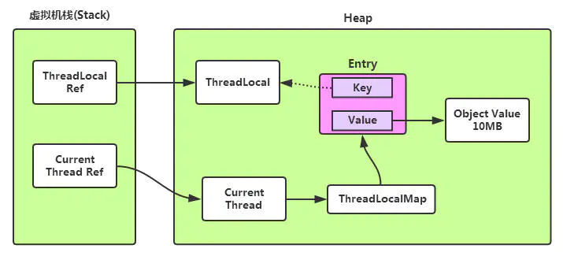

### 高级 Java 技术面试总结
- 主动复习策略：**只看标题，自己脑子里面进行回答**，不仅能调动积极性，也不至于昏昏欲睡，并且复习速度也更快。
- 多动笔写写，手写的比使用电脑记录内容，记忆程度更深；


### 0. 目录
1. [Java 基础](#1)
2. [JVM 相关](#2)
3. [Java 集合](#3)
4. [并发编程](#4)
5. [Spring](#5)
6. [MySQL](#6)
7. [Redis](#7)
8. [ElasticSearch](#8)
9. [消息队列(kafka)](#9)
10. [Dubbo](#10)
11. [设计模式](#11)
12. [算法](#12)
13. [领域驱动设计(DDD)](#13)
14. [系统设计相关](#14)

### 1 Java 基础
1.1 八种基本数据类型：
  - `byte`，`short`，`int`，`long`，`float`，`double`，`boolean`，`char`

1.2 面向对象的三大特性：
  - 封装，继承，多态

1.3 多态的三个前提：
  - 两个类要有继承关系；
  - 子类要重写父类方法；
  - 父类引用指向子类；

1.4 接口与抽象类区别：
  - 一个类只能继承一个抽象类，但可以实现多个接口；
  - 抽象类可以提供成员方法的实现细节；接口中只能存在 `public abstract` 方法；
  - 抽象类中的成员变量可以是各种类型的；接口中的成员变量只能是 `public static final` 类型的；
  - 抽象类中可以有静态代码块和静态方法；接口中不能含有静态代码块及静态方法；

1.5 `final` 关键字
- 被 final 修饰的类不能被继承；
- 被 final 修饰的方法不能被覆盖重写；
- 被 final 修饰的成员变量，表示常量，只能被赋值一次，赋值后值不再改变，而且必须显式赋值；
- 被 final 修饰的局部变量(参数列表和方法内局部变量)，表示不可再更改；
- 安全发布，当创建一个对象时，使用 final 关键字能够使得另一个线程不会访问到处于“部分创建”的对象；

1.6 异常分类
- Error：`StackOverfowError`、`OutOfMemoryError`
- `java.lang.RuntimeException` 是 unchecked exception，子类包括：
  - `NullPointerException`、`ClassCastException`、`ArithmeticException`、`IndexOutOfBoundsException`；
- checked exception 是从 `java.lang.Exception` 衍生出来，非 `RuntimeException` 的子类异常，包括：
  - `IOException`、`ClassNotFoundException`、`SQLException`；
  - checked exception 在定义方法时，必须声明所有可能会抛出的 checked exception;
  - 在调用这个方法时，必须捕获它的 checked exception；

### 2 JVM 相关
2.1 JVM 内存布局
- 按照线程是否共享来分类：


- 堆的默认空间分配
  - `-Xms`: memory start；
  - `-Xmx`: memory max；


2.2 判断对象是否存活
- 可达性分析：从 GC Roots 为起点开始向下搜索，搜索所走过的路径称为引用链。当一个对象到 GC Roots 没有任何引用链相连时，则证明此对象是不可用的，可以被回收。

2.3 Java 中的引用
- 强引用（Strong Reference）：如果一个对象 GC Roots 可达，强引用不会被回收；
- 软引用（Soft Reference）：当 JVM 认为内存不足时，会清理软引用指向的对象；通常用来实现内存敏感的缓存；
- 弱引用（Weak Reference）：无论内存是否充足，都会回收跟弱引用关联的对象；
- 虚引用（Phantom Reference）：虚引用不会对对象生存时间构成影响，只是为了在这个对象被收集器回收时收到一个系统通知；

2.4 GC 算法
- 标记-清除算法(Mark-Sweep)：会产生大量不连续的内存碎片；
- 标记-复制算法(Coping)：每次是对整个半区进行内存回收，缺点：可用内存缩小到原来的一半；
- 标记-压缩算法(Mark-Compact)：能够解决内存碎片化问题，但压缩算法的性能开销也不小；

2.5 垃圾回收器：
- 新生代：ParNew + 老年代：CMS
  - 启用 CMS 收集器：`-XX:+UseConcMarkSweepGC`
- CMS 运行过程：
  - 初始标记 -> 并发标记 -> 重新标记 -> 并发清除
  - 特点：并发收集，低停顿；
- G1 垃圾收集器
  - 将连续的堆内存划分为多个大小相等的 Region，可以通过参数`-XX:G1HeapRegionSize`设置，取值范围为 `1M ~ 32M`；
  - H 区：专门用来存储大对象；只要超过 Region 容量一半的对象即可判定为大对象；
  - 根据允许的收集时间，优先回收价值最大的 Region，避免 Full GC；
  - 使用 Remembered Set(记忆集) 避免全堆作为 GC Roots 扫描；
    - RSet 用于记录和维护 Region 之间的对象引用关系；用于记录其他 Region 中的对象引用本 Region 中对象的关系；
  - Collection Set(CSet)：记录了等待回收的 Region 集合；

2.6 JVM 调优
- JVM 调优的目的：尽量减少停顿时间，提高系统的吞吐量；
- 触发 Full GC 的情况：
  - 老年代空间不足，产生 Concurrent mode failure 或 promotion failed
    - Young GC 时，晋升老年代内存平均值大于老年代剩余空间；
    - Survivor 空间不足，Survivor 中对象还不足以晋升到老年代，从年轻代晋升到 Survivor 的对象大于 Survivor 剩余空间；
  - 元空间不足，扩容导致 STW 的 Full GC；
  - 有连续的大对象需要分配；
- 解决方案：
  - 老年代空间不足：
    - 增加新生代和老年代的内存；
    - 由于 Concurrent mode failure 发生后，CMS GC 会退回到 Serial Old GC，导致停顿时间延长；因此需要尽早执行 CMS GC，调低触发 CMS GC 执行的阈值：`-XX:CMSInitiatingOccupancyFraction = 68%`，默认值为 92%；
  - 元空间不足：
    - 配置：`-XX:MetaspaceSize=128 -XX:MaxMetaspaceSize=128`；
    - 元空间初始大小为 20.75M；

2.7 CPU 经常 100%，排查步骤：
- `top`：查看系统 CPU 的占用情况；
- `top -Hp [java 系统的 pid]`：查看该进程下各个线程 CPU 和内存占用情况；
- `jstack [进程号] | grep [线程号]`：查看线程栈情况
  - 如果结果中存在 `VM Thread`，则表示当前线程是垃圾回收的线程，也基本上可以确定，当前系统缓慢的原因主要是垃圾回收过于频繁，导致 GC 停顿时间较长；
- `jstat -gcutil [pid] 1000 10`：监测 GC 回收频率；

2.8 内存泄漏相关
- 定义：内存泄漏，是指程序内动态分配的堆内存由于某种原因程序未释放或者无法释放，导致系统内存浪费，程序运行速度变慢甚至系统崩溃等严重后果；
- 内存泄漏的表现：
  - 发生 OOM 错误；
  - 请求响应时间变长，因为频繁发生 Full GC，暂停其他业务线程(Stop The World)造成的；
- 方案：
  - 运行参数配置：`-XX:+HeapDumpOnOutOfMemoryError -XX:+HeapDumpPath=${指定 dump 文件的目录}`；
  - 使用 VisualVM 工具分析 dump 出的内存快照，定位主要是什么对象比较消耗内存，优化相关代码；

### 3. Java 集合
3.1 String，StringBuilder 和 StringBuffer
- StringBuilder 可变，线程不安全；
- StringBuffer 可变，线程安全，内部方法使用了 synchronized 锁；
- String 不可变
  - String 类中真正存储字符的地方是 `private final char value[];`，被 final 修饰；
  - String 类被 final 修饰，不可继承；
  - String 源码中涉及到到 char 数组进行修改的操作全部都会重新创建一个 String 对象；

3.2 ArrayList 和 LinkedList
- ArrayList 基于动态数组，LinkedList 基于链表；
- 对于随机 index 访问，ArrayList 优于 LinkedList，ArrayList 可以直接通过数组下标找到元素；
- 新增和删除元素，LinkedList 由于 ArrayList，在新增或删除元素时，ArrayList 可能需要**扩容和复制**数组，而 LikedList 只需要修改指针即可；

3.3 CopyOnWriteArrayList
- 核心概念：读写分离，空间换时间；利用 CopyOnWrite（写时复制） 思想，在写时复制一份副本进行修改，修改完成后，再将新值赋给旧值；
- CopyOnWrite 的问题：
  - 内存占用问题：CopyOnWrite 因为复制副本，所以占用双倍内存，可能造成频繁的 Young GC 和 Full GC；
  - 数据一致性问题：CopyOnWrite 只保证了数据最终一致性，无法保证数据实时一致性；
- CopyOnWrite 适用场景：
  - 适合读多写少，且复制的对象不宜过大；
  - 添加、删除元素时，尽量使用 `addAll` 或 `removeAll` 批量添加(或删除)；

3.4 foreach 循环里面为什么不能进行元素的 `add/remove` 操作？
- 反编译 foreach 生成的 `.class` 文件，会发现增强 for 循环，底层依赖 `while` 循环和 `Iterator` 实现；
- 增强 for 循环，集合的遍历是通过 `Iterator` 进行的；
- 集合元素的 `add/remove` 操作，是通过 ArrayList 或 LinkedList 的 `add/remove` 方法，其源码中会调用 `modCount++`；
- 通过 `Iterator` 迭代时，每次调用 `next()` 方法，都会调用 `checkedForModification()` 方法，检查集合在遍历过程中是否被修改，如果 `modCount != expectedModCount`，会抛出 `ConcurrentModificationException`；
- **根本原因**：ArrayList 自带的 `add/remove` 方法不会去更新 Iterator 自身的 `expectedModCount` 值；
  - `fail-fast`，快速失败机制，当在迭代集合的过程中，集合元素发生变化时，就可能抛出 `ConcurrentModificationException`；
- 优化：`remove` 元素使用 Iterator 方式，使用 Iterator 的 `add/remove` 方法，除了调用对应集合的 `add/remove` 方法，还会修改自身的 `expectedModCount`；

<details>
<summary>反编译的 foreach 文件</summary>

```java
// 增强 for 循环
public static void main(String[] args) {
    List<String> list = new ArrayList<>();
    list.add("a");
    list.add("b");
    for(String item : list) {
        if ("b".equals(item)) {
            list.remove(item);
        }
    }
}

// IDEA 查看反编译后结果：
public static void main(String[] var0) {
    ArrayList var1 = new ArrayList();
    var1.add("a");
    var1.add("b");
    Iterator var2 = var1.iterator();

    while(var2.hasNext()) {
        String var3 = (String)var2.next();
        if ("b".equals(var3)) {
            var1.remove(var3);
        }
    }
}
```
</details>

3.5 HashMap
- 数据结构：数组 + 链表 + 红黑树；
- 扰动函数：优化散列效果，增加随机性，减少哈希碰撞；
- 初始化大小为 16；
- 负载因子：0.75，当阈值容量占了 3/4 时，就需要进行扩容，减少哈希碰撞；
- 扩容的算法：`e.hash & oldCap == 0`，判断当前节点是否需要移位，若为 0，不需要移动；若为 1，则需要移动至 (oldCap + 扩容容量)的位置；
- 链表转红黑树的条件：
  - 链表长度 >= 8，且存 key 值的数组桶容量大于 64；否则，只会扩容，不会树化；
- 不安全的原因：
  - Java 7：并发扩容时，采用**头插法**，造成链表逆序，容易出现环形链表，造成死循环；
  - Java 8：并发扩容时，采用**尾插法**，但是没有同步锁保护，可能造成数据被覆盖；

### 4. 并发编程
4.1 Thread 介绍
- `run()`：Thread 类继承了 `Runnable` 接口，重写了 `run()` 方法；`run()` 方法用于封装需要执行的任务；
- `start()`：用于线程的初始化，调度执行 `run()` 方法封装的任务；
- 创建 Thread 只有一种途径，借助构造方法，`new Thread` 对象；封装任务有两种方式：
  - 继承 Thread，重写 run 方法；
  - 实现 `Runnable` 接口，将实例对象传递给 Thread 构造函数；
  - 实现 `Callable` 接口，和 `FutureTask` 接口；

- `FutureTask` 介绍
  - 异步执行，可执行多次(通过 `runAndReset()` 方法)，也可以仅执行一次(执行 `run()` 方法）；
  - 可获取线程执行结果；

<details>
<summary>`FutureTask` 源码分析</summary>

```java
// FutureTask 的 run() 代码仅执行一次
public void run() {
    /**
     * FutureTask 的 run 方法仅执行一次的原因：
     *   1，state != NEW 表示任务正在被执行或已经执行完成，直接返回；
     *   2，若 state == NEW，则尝试 CAS 将当前线程设置为执行 `run()` 的线程，若设置失败，说明已经有其他线程在执行该任务了，当前线程退出；
     */
    if (state != NEW ||
        !UNSAFE.compareAndSwapObject(this, runnerOffset,
                                      null, Thread.currentThread()))
        return;
    try {
        Callable<V> c = callable;
        if (c != null && state == NEW) {
            V result;
            boolean ran;
            try {
                result = c.call();
                ran = true;
            } catch (Throwable ex) {
                result = null;
                ran = false;
                setException(ex);
            }
            if (ran)
                set(result);
        }
    } finally {
        // runner must be non-null until state is settled to
        // prevent concurrent calls to run()
        runner = null;
        // state must be re-read after nulling runner to prevent
        // leaked interrupts
        int s = state;
        if (s >= INTERRUPTING)
            handlePossibleCancellationInterrupt(s);
    }
}

// FutureTask 如何拿到线程执行的结果：
//   - 主要依赖 FutureTask 类内部的 Callable 属性；

// FutureTask 可能得执行过程：
//  顺利完成：NEW -> COMPLETING -> NORMAL
//  异常退出：NEW -> COMPLETING -> EXCEPTIONAL
//  被取消：  NEW -> CANCELLED
//  被中断：  NEW -> INTERRUPTING -> INTERRUPTED
```
</details>

4.2 Thread 状态
- Runnable 状态包含 Ready、Running 两种状态；
  - Ready：等待操作系统分配 CPU 时间片；
  - Running：正在占用 CPU 运行；


4.3 `wait`、`sleep`、`join` 方法区别：
- `wait` 和 `sleep` 都会使线程进入阻塞状态，都是可中断方法，被中断后，会抛出 `InterruptedException`；
- `wait` 是 Object 方法，`sleep` 是 Thread 方法；
- `wait` 必须在同步方法(或同步代码块)中使用，`sleep` 不需要；
- `wait` 会释放锁，`sleep` 不会释放锁；
- `join` 是 Thread 中的 synchronized 修饰的方法，里面调用了 `wait` 方法，让持有当前同步锁的线程进入等待状态，也就是主线程，当子线程执行完毕后，JVM 会调用 `lock.notifyAll(thread)` 方法，唤醒主线程继续执行；

4.4 `ThreadLocal`
- Thread 类有一个类型为 `ThreadLocal.ThreadLocalMap` 的实例变量 `threadLocals`，每个线程在往 `ThreadLocal` 里面放值时，都是往线程的 `ThreadLocalMap` 里面存，key 为 `ThreadLocal` 的一个弱引用；
- 使用 `ThreadLocal` 一定要记得执行 `new ThreadLocal<>().remove()` 方法，避免在发生 GC 后，弱引用 key 被回收，导致内存泄漏；
- **ThreadLocal 内存泄漏：** `ThreadLocalMap` 的生命周期和 Thread 一样长，当一个 ThreadLocal 的所有强引用都被移除后，但绑定了对应信息的线程还存在时，触发 GC 后，对应的 key 会被回收置为 null，而 value 还存在于内存中，但无法访问；

```java
// ThreadLocalMap 中的 Entry 类
static class Entry extends WeakReference<ThreadLocal<?>> {
    /** The value associated with this ThreadLocal. */
    Object value;
    Entry(ThreadLocal<?> k, Object v) {
        super(k);
        value = v;
    }
}
```



4.5 内存模型(JMM，Java Memory Model)
- 主内存：所有线程共享；
- 工作内存：线程私有部分；


4.6 线程安全问题，主要分为三类
- 原子性、可见性、有序性

- 原子性：多个操作作为一个整体，要么全部执行，要么不执行；
  - 锁机制：锁具有排他性，它能保证一个共享变量在任意一个时刻仅仅被一个线程访问；
  - 借助于处理器提供的 CAS 指令；
- 可见性：如果一个线程对某个共享变量进行更新之后，后续访问该变量的线程可以读到更新后的结果，则称为这个线程对该共享变量的更新对其他线程可见；
- 有序性：重排序是对内存访问操作的一种优化，它可以在不影响单线程程序正确的前提下，进行一定的调整，进而提高程序的性能；
  - `As-if-Serial Semantics`：貌似串行语义，从单线程的角度保障不会出现问题，但是对于多线程就可能出现问题；

4.7 `volatile`
- `volatile` 通过**内存屏障**来保证可见性、有序性以及自身修饰变量的原子性，但是不能保障代码段的原子性，是一种弱同步；
  - 当一个线程对 `volatile` 修饰的变量进行写操作时，JMM 会把最新值刷新到主内存；
  - 当一个线程对 `volatile` 修饰的变量进行读操作时，JMM 会把该线程对应的本地内存置为无效，从主内存中读取最新的值；

4.8 `synchronized`


4.9 `AbstractQueuedSynchronizer`(AQS)


### 5. Spring


### 6. MySql

### 7. Redis
#### 7.1 常用数据结构
- `String`：分布式锁、存储简单的热点数据；
- `Hash`：用户基本信息，用于抽奖的活动信息(活动的名称，开始时间，结束时间，审核状态等等)；
- `Set`：共同好友，共同喜好，客户的兴趣标签；
- `zSet`：文章点赞排行榜、延时队列；
- `List`
- `zSet` 底层是 `ziplist` 或者 `skiplist`，`skiplist`(跳表)的优势：
  - 查找单个 key，`skiplist`和红黑树的平均时间复杂度都为`O(logN)`；
  - 跳表的内存占用比红黑树要少，红黑树的每个节点包含 2 个指针（分别指向左右子树），而跳表每个节点包含的指针数目平均为 `1/(1-p)`，Redis 的实现中取 p=1/4，平均每个节点包含 1.33 个指针；
  - 跳表的范围查找比红黑树简单，红黑树找到指定范围的小值之后，还需要通过中序遍历查找其他不超过大值的节点。跳表的范围查找，只需要找到小值之后，对第一层链表进行若干步的遍历即可；
    - `skiplist`和各种平衡树（如 AVL、红黑树等）的元素是有序排列的，而哈希表不是有序的；
    - 所谓范围查找，指的是查找那些大小在指定的两个值之间的所有节点；
  - 跳跃表比红黑树更容易实现，因为红黑树的插入和删除操作，可能需要做一些 rebalance 操作，而跳表的插入和删除只需要修改相邻节点的指针；
- `skiplist(跳表)`是一种有序的数据结构，它通过在每个节点中维持多个指向其他节点的指针，从而达到快速访问节点的目的；
  - 跳表在链表的基础上，增加了多层级索引，通过索引位置的跳转，实现数据的快速定位；

#### 7.2 Redis 集群
- Redis 集群满足 CAP 中的 `CP`，即一致性和分区容错性；
  - Redis Cluster 集群中，如果某个主节点没有从节点，那么当它发生故障时，集群将完全处于不可用状态。
- 集群类型：
  - Redis Sentinel 着眼于**高可用**；
  - Redis Cluster 着眼于**扩展性**，用于扩展内存，三主三从；
- Redis 有多个节点时，key 存储在哪个节点？
  - 普通 hash 算法：增加或删除节点时，基本上所有的数据都要重建路由；
  - 一致性 Hash 算法 + 虚拟节点：
    - 将 `0 ~ （2^32）- 1`的范围，抽象为一个圆环，使用 CRC16 算法计算出来的哈希值会落在圆环的某个位置；
    - 优势：如果一个节点挂了，只影响此节点到环空间前一个节点（沿着逆时针方向行走遇到的第一个节点）之间的数据，其他不受影响；
    - 问题：在节点太少时，因为节点分布不均匀，造成数据倾斜（被缓存的对象大部分几种缓存在某一台服务器上）；
    - 引入虚拟节点机制，即对每个节点计算多个 hash，每个计算结果位置都放置一个虚拟节点；
  - redis cluster 的 hash slot 算法
    - redis cluster 有固定的 16384(2^14) 个桶，对每个 key 计算 CRC16 的值，然后对 16384 取模，可以获取 key 对应的 hash slot；
- Redis Cluster 故障转移
  - // TODO: 待做


// TODO: 如何做？？？
- 集群模式、故障转移、宕机问题
- 缓存常见问题
- Redis 分布式锁

### 8. ElasticSearch
es：
  - keyword 和 Text 的区别
  - join 连表查询的解决方案
  - mysql 同步到 ES，join 查询解决方案：https://www.infoq.cn/article/1afyz3b6hnhprrg12833
- https://www.cnblogs.com/hahaha111122222/p/12177377.html

### 9. 消息队列(Kafka)

### 10. Dubbo


### 11. 设计模式
- 单例模式示例

<details>
<summary>单例模式</summary>

```java
// TODO: 懒汉、饿汉、双重检查锁
```
</details>

### 12. 算法
- [leetcode 第一题解法](https://www.bilibili.com/video/BV1Hy4y1B78T?p=4)


### 13. [领域驱动设计(DDD)](https://github.com/xianliu18/ARTS/blob/master/ddd/03总结.md)
#### 13.1 贫血模型和充血模型
- MVC 架构，Repository 层负责数据访问，Service 层负责业务逻辑，Controller 层负责暴露接口；
- 贫血模型(Anemic Domain Model)：
  - 将数据和业务逻辑分离，如 Service 层的数据和业务逻辑，被分割为 BO 和 Service 两个类；
    - 弊端：数据和业务逻辑分离之后，数据本身的操作就不受限制了，任何代码都可以随意修改数据；
- 充血模型(Rich Domain Model)：
  - 数据和业务逻辑被封装同一个类中；
  - 基于充血模型的 DDD 开发模式中，Service 层包含 Service 类和 Domain 类两部分；Domain 就相当于贫血模型中的 BO。不过，Domain 中既包含数据，也包含业务逻辑，而 Service 类变得非常单薄；
  - Service 层的作用：
    - Service 类负责与 Repository 交互；将流程性的代码逻辑（比如从 DB 中取数据、映射数据）与领域模型的业务逻辑解耦，让领域模型更加可复用；
    - Service 类负责跨领域模型的业务聚合功能；
    - Service 类负责一些非功能性的工作，比如幂等、事务、发邮件、发消息、记录日志、调用其他系统的 RPC 接口等；
  - 基于充血模型的 DDD 开发模式中，Controller 层和 Repository 层仍采用贫血模型，
    - 因为 Repository 的 Entity 传递到 Service 层之后，就会转化成 BO 或者 Domain 来继续后面的业务逻辑。Entity 的生命周期到此就结束了，所以并不会被到处任意修改；
    - 而 Controller 层实体一种 DTO(Data Transfer Object，数据传输对象)，它不包含业务逻辑、只包含数据。所以，将 VO 设计成贫血模型也是比较合理的。
- 总的来说，基于贫血模型的传统开发模式，重 Service 轻 BO；基于充血模型的 DDD 开发模式，轻 Service 重 Domain；

#### 13.2  贫血模型和充血模型的开发流程
- 基于贫血模型的传统开发模式：
  - 大部分都是 SQL 驱动的开发模式。
  - 我们接到一个后端接口的开发需求的时候，就去看接口需要的数据对应到数据库中，需要哪张表或者哪几张表，然后思考如何编写 SQL 语句来获取数据。之后就是定义 Entity、BO、VO，然后模板式地往对应的 Repository、Service、Controller 类中添加代码；
  - SQL 都是针对特定的业务功能编写的，复用性差；当我开发另一个业务功能的时候，只能重新写个满足新需求的 SQL 语句，这就可能导致各种长得差不多、区别很小的 SQL 语句满天飞；
  
- 基于充血模型的 DDD 开发模式的开发流程，在应对复杂业务系统的开发的时候更加有优势；
  - 首先理清楚所有的业务，定义领域模型所包含的属性和方法。领域模型相当于可复用的业务中间层。新功能需求的开发，都基于之前定义好的这些领域模型来完成；
  - 越复杂的系统，对代码的复用性、易维护性要求就越高，我们就应该花更多的时间和精力在前期设计上。而基于充血模型的 DDD 开发模式，正好需要我们前期做大量的业务调研、领域模型设计，所以它更加适合这种复杂系统的开发；

#### 13.3 不同架构之间的区别
- DDD 分层架构(抽奖系统所使用的)
  - 用户接口层：为前端提供接口；
  - 应用层：
    - 协调多个聚合的服务和领域对象完成服务编排和组合；
  - 领域层：核心业务逻辑，包含聚合根、实体、值对象、领域服务；
    - 当领域中的某些功能，单一实体（或者值对象）不能实现时，领域服务可以组合聚合内的多个实体（或者值对象），实现复杂的业务逻辑；
  - 基础层：为其他各层提供通用的技术和基础服务，包括第三方工具、驱动、消息中间件、网关、缓存以及数据库等；
- 分层架构根据耦合的紧密程度分为：严格分层架构和松散分层架构：
  - 严格分层架构：任何层只能对于其直接下方的层产生依赖；服务是逐层对外封装或组合的，依赖关系清晰；
  - 松散分层架构：允许某层与其任意下方的层发生依赖；服务的依赖关系比较复杂且难管理，甚至容易使核心业务逻辑外泄；


- 六边形架构（又称“端口和适配器模式”）
  - 核心理念是：**应用通过端口与外部进行交互**；
  - 六边形架构将系统分为内六边形和外六边形：
  - 内六边形是领域业务层，负责业务逻辑的组织和实现；
  - 外六边形是适配器层，负责与外部进行交互；
    - 主动适配器：主动调用应用核心端口，触发应用执行某项活动；
    - 被动适配器：被应用核心端口调用来执行动作，实现应用定义的端口；
      - 如端口RespositoryInterface -> 被动适配器Mysql实现MysqlRepositoryImpl -> 调用Mysql数据库


- 洋葱架构和整洁架构中的层就像洋葱片一样，体现了分层设计的思想，以及高内聚、低耦合的设计特性；

- 洋葱架构(Onion Architecture)
  - 洋葱架构在六边形架构的基础上，将内层(业务逻辑层)进一步划分：
    - 洋葱架构的最外层包括：用户接口、基础设施、测试策略；
    - 洋葱架构的内层，即原来六边形架构中的业务逻辑层：
      - 应用服务层
      - 领域服务层
      - 领域模型层
    - 在洋葱架构里面，同心圆代表应用软件的不同部分，从里到外依次是领域模型，领域服务，应用服务和外层的基础设施和用户终端；
  - 洋葱架构明确了依赖方向：
    - 外层依赖内层；
    - 内层不知道外层的存在；
    - 且在不破坏依赖方向的前提下，外层亦可以直接调用任一内层（不一定是相邻接的2层）；


- 整洁架构(Clean Architecture)
  - 与洋葱架构相比，整洁架构调整如下：
    - `Application Services` 调整为 `Use Cases`；
    - `Domain Services` 和 `Domain Model` 调整为 `Entities`；


- CQRS
  - 读写分离

### 14. 系统设计相关

